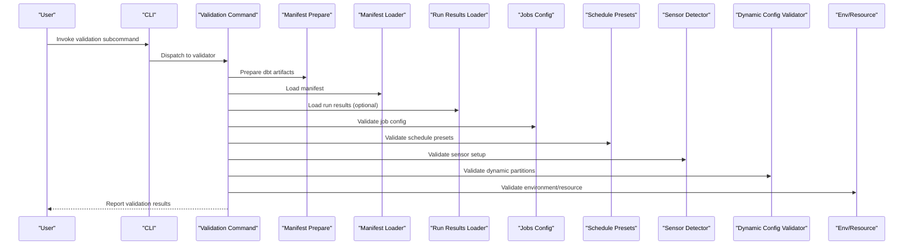
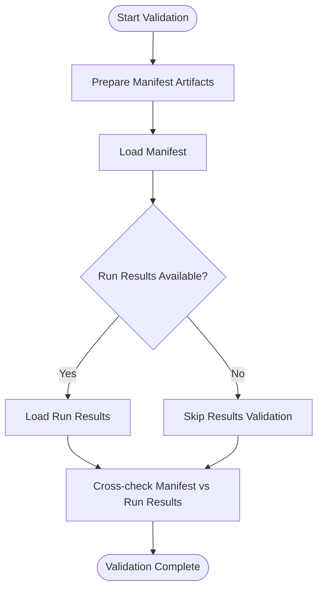
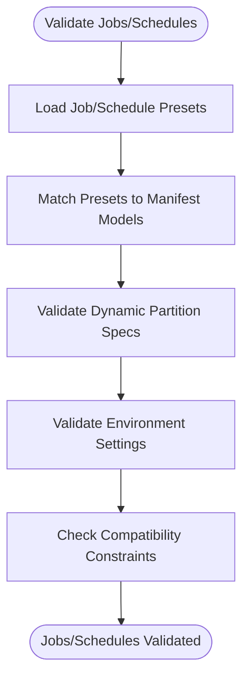
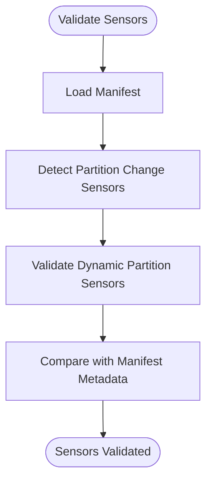
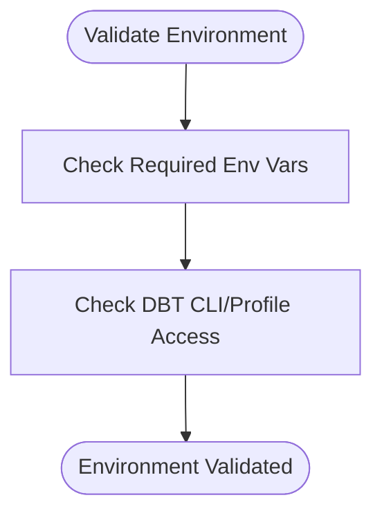
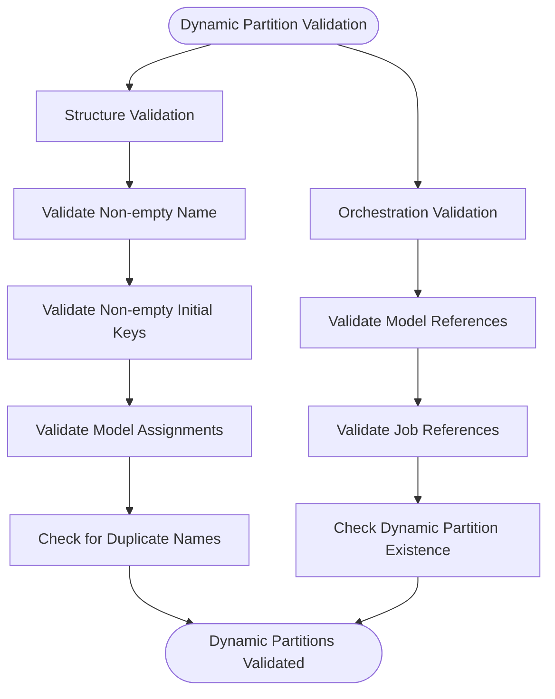
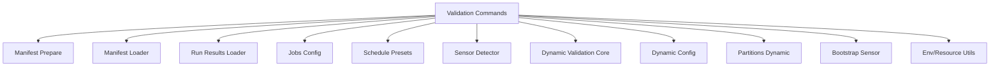

# Validation Commands

<cite>
**Referenced Files in This Document**
- [cli.py](file://src/dbt_dagsterizer/cli.py)
- [validation.py](file://src/dbt_dagsterizer/cli_parts/validation.py)
- [project.py](file://src/dbt_dagsterizer/cli_parts/project.py)
- [app.py](file://src/dbt_dagsterizer/cli_parts/app.py)
- [common.py](file://src/dbt_dagsterizer/cli_parts/common.py)
- [manifest.py](file://src/dbt_dagsterizer/dbt/manifest.py)
- [manifest_prepare.py](file://src/dbt_dagsterizer/dbt/manifest_prepare.py)
- [run_results.py](file://src/dbt_dagsterizer/dbt/run_results.py)
- [dbt_config.py](file://src/dbt_dagsterizer/jobs/dbt_config.py)
- [presets.py](file://src/dbt_dagsterizer/schedules/presets.py)
- [dbt_manifest.py](file://src/dbt_dagsterizer/sensors/partition_change/detector/dbt_manifest.py)
- [dbt.py](file://src/dbt_dagsterizer/resources/dbt.py)
- [env_utils.py](file://src/dbt_dagsterizer/env_utils.py)
- [orchestration_config.py](file://src/dbt_dagsterizer/orchestration_config.py)
- [partitions_dynamic.py](file://src/dbt_dagsterizer/partitions_dynamic.py)
- [dynamic.py](file://src/dbt_dagsterizer/sensors/partition_change/detector/dynamic.py)
- [dynamic_partitions_bootstrap.py](file://src/dbt_dagsterizer/sensors/dynamic_partitions_bootstrap.py)
- [test_dynamic_partitions.py](file://tests/test_dynamic_partitions.py)
- [README.md](file://README.md)
</cite>

## Update Summary
**Changes Made**
- Enhanced validation logic to support dynamic partition configurations with proper formatting checks
- Added validation for dynamic partition existence and referenced dynamic partition validation
- Updated partition type validation to accept "dynamic:name" format alongside existing "daily" and "unpartitioned" types
- Added comprehensive validation rules for dynamic partition definitions including duplicate names, empty keys, and model assignments
- Integrated dynamic partition validation into both structure validation and orchestration validation flows

## Table of Contents
1. [Introduction](#introduction)
2. [Project Structure](#project-structure)
3. [Core Components](#core-components)
4. [Architecture Overview](#architecture-overview)
5. [Detailed Component Analysis](#detailed-component-analysis)
6. [Dynamic Partition Validation](#dynamic-partition-validation)
7. [Dependency Analysis](#dependency-analysis)
8. [Performance Considerations](#performance-considerations)
9. [Troubleshooting Guide](#troubleshooting-guide)
10. [Conclusion](#conclusion)

## Introduction
This document describes validation-related CLI commands in dbt-dagsterizer. It focuses on commands that check dbt project integrity, manifest consistency, configuration correctness, asset dependencies, schedule configurations, sensor setups, environment readiness, dependency resolution, and compatibility verification. The documentation has been updated to include enhanced dynamic partition validation capabilities that validate dynamic partition configurations with proper formatting checks and referenced dynamic partition existence validation.

## Project Structure
The CLI entrypoint composes subcommands from modular parts. Validation logic is centralized under a dedicated validation module and integrates with dbt manifest preparation and runtime helpers. The validation system now includes comprehensive support for dynamic partitions alongside traditional time-based partitions.

```mermaid
graph TB
CLI["CLI Entrypoint<br/>cli.py"] --> APP["App Builder<br/>cli_parts/app.py"]
CLI --> COMMON["Common Helpers<br/>cli_parts/common.py"]
CLI --> VALIDATION["Validation Commands<br/>cli_parts/validation.py"]
CLI --> PROJECT["Project Commands<br/>cli_parts/project.py"]
VALIDATION --> MANIFEST_PREP["Manifest Preparation<br/>dbt/manifest_prepare.py"]
VALIDATION --> MANIFEST["Manifest Loader<br/>dbt/manifest.py"]
VALIDATION --> RUN_RESULTS["Run Results Loader<br/>dbt/run_results.py"]
VALIDATION --> JOBS_CFG["Jobs Config<br/>jobs/dbt_config.py"]
VALIDATION --> SCHEDULE_PRESETS["Schedule Presets<br/>schedules/presets.py"]
VALIDATION --> SENSOR_DETECTOR["Sensor Detector<br/>sensors/.../detector/dbt_manifest.py"]
VALIDATION --> DYNAMIC_SENSOR["Dynamic Sensor Detector<br/>sensors/.../detector/dynamic.py"]
VALIDATION --> ORCH_CONFIG["Orchestration Config<br/>orchestration_config.py"]
VALIDATION --> PARTITION_DYNAMIC["Dynamic Partitions<br/>partitions_dynamic.py"]
VALIDATION --> BOOTSTRAP_SENSOR["Bootstrap Sensor<br/>sensors/dynamic_partitions_bootstrap.py"]
VALIDATION --> RES_DBT["DBT Resource<br/>resources/dbt.py"]
VALIDATION --> ENV["Environment Utils<br/>env_utils.py"]
```

**Diagram sources**
- [cli.py](file://src/dbt_dagsterizer/cli.py)
- [app.py](file://src/dbt_dagsterizer/cli_parts/app.py)
- [common.py](file://src/dbt_dagsterizer/cli_parts/common.py)
- [validation.py](file://src/dbt_dagsterizer/cli_parts/validation.py)
- [project.py](file://src/dbt_dagsterizer/cli_parts/project.py)
- [manifest_prepare.py](file://src/dbt_dagsterizer/dbt/manifest_prepare.py)
- [manifest.py](file://src/dbt_dagsterizer/dbt/manifest.py)
- [run_results.py](file://src/dbt_dagsterizer/dbt/run_results.py)
- [dbt_config.py](file://src/dbt_dagsterizer/jobs/dbt_config.py)
- [presets.py](file://src/dbt_dagsterizer/schedules/presets.py)
- [dbt_manifest.py](file://src/dbt_dagsterizer/sensors/partition_change/detector/dbt_manifest.py)
- [dynamic.py](file://src/dbt_dagsterizer/sensors/partition_change/detector/dynamic.py)
- [orchestration_config.py](file://src/dbt_dagsterizer/orchestration_config.py)
- [partitions_dynamic.py](file://src/dbt_dagsterizer/partitions_dynamic.py)
- [dynamic_partitions_bootstrap.py](file://src/dbt_dagsterizer/sensors/dynamic_partitions_bootstrap.py)
- [dbt.py](file://src/dbt_dagsterizer/resources/dbt.py)
- [env_utils.py](file://src/dbt_dagsterizer/env_utils.py)

**Section sources**
- [cli.py](file://src/dbt_dagsterizer/cli.py)
- [validation.py](file://src/dbt_dagsterizer/cli_parts/validation.py)
- [project.py](file://src/dbt_dagsterizer/cli_parts/project.py)

## Core Components
- Validation command group: Provides subcommands to validate dbt project integrity, manifest consistency, configuration correctness, asset dependencies, schedule configurations, sensor setups, environment readiness, dependency resolution, compatibility, and dynamic partition configurations.
- Manifest preparation and loading: Ensures dbt artifacts are ready and consistent before validation.
- Jobs and schedules configuration: Validates job and schedule presets against dbt project metadata.
- Sensor detection: Validates partition-change sensor setup against dbt manifest, including dynamic partition sensors.
- Dynamic partition validation: Validates dynamic partition configurations with proper formatting checks and referenced dynamic partition existence validation.
- Environment and resource helpers: Validates environment variables and DBT resource availability.

**Section sources**
- [validation.py](file://src/dbt_dagsterizer/cli_parts/validation.py)
- [manifest_prepare.py](file://src/dbt_dagsterizer/dbt/manifest_prepare.py)
- [manifest.py](file://src/dbt_dagsterizer/dbt/manifest.py)
- [run_results.py](file://src/dbt_dagsterizer/dbt/run_results.py)
- [dbt_config.py](file://src/dbt_dagsterizer/jobs/dbt_config.py)
- [presets.py](file://src/dbt_dagsterizer/schedules/presets.py)
- [dbt_manifest.py](file://src/dbt_dagsterizer/sensors/partition_change/detector/dbt_manifest.py)
- [dynamic.py](file://src/dbt_dagsterizer/sensors/partition_change/detector/dynamic.py)
- [orchestration_config.py](file://src/dbt_dagsterizer/orchestration_config.py)
- [partitions_dynamic.py](file://src/dbt_dagsterizer/partitions_dynamic.py)
- [dynamic_partitions_bootstrap.py](file://src/dbt_dagsterizer/sensors/dynamic_partitions_bootstrap.py)
- [dbt.py](file://src/dbt_dagsterizer/resources/dbt.py)
- [env_utils.py](file://src/dbt_dagsterizer/env_utils.py)

## Architecture Overview
The validation commands are composed via the CLI entrypoint and delegate to specialized validators. Validators load and cross-check dbt artifacts, configuration presets, environment settings, and dynamic partition configurations. The architecture now includes dedicated validation flows for dynamic partitions alongside traditional validation components.

**Diagram sources**
- [cli.py](file://src/dbt_dagsterizer/cli.py)
- [validation.py](file://src/dbt_dagsterizer/cli_parts/validation.py)
- [manifest_prepare.py](file://src/dbt_dagsterizer/dbt/manifest_prepare.py)
- [manifest.py](file://src/dbt_dagsterizer/dbt/manifest.py)
- [run_results.py](file://src/dbt_dagsterizer/dbt/run_results.py)
- [dbt_config.py](file://src/dbt_dagsterizer/jobs/dbt_config.py)
- [presets.py](file://src/dbt_dagsterizer/schedules/presets.py)
- [dbt_manifest.py](file://src/dbt_dagsterizer/sensors/partition_change/detector/dbt_manifest.py)
- [dynamic.py](file://src/dbt_dagsterizer/sensors/partition_change/detector/dynamic.py)
- [orchestration_config.py](file://src/dbt_dagsterizer/orchestration_config.py)
- [env_utils.py](file://src/dbt_dagsterizer/env_utils.py)

## Detailed Component Analysis

### Validation Command Group
- Purpose: Centralized validation commands for dbt project integrity, manifest consistency, configuration correctness, asset dependencies, schedule configurations, sensor setups, environment readiness, dependency resolution, compatibility, and dynamic partition configurations.
- Composition: Built from the CLI entrypoint and routed to the validation module.
- Enhanced: Now includes comprehensive dynamic partition validation alongside traditional validation components.

**Section sources**
- [cli.py](file://src/dbt_dagsterizer/cli.py)
- [validation.py](file://src/dbt_dagsterizer/cli_parts/validation.py)

### Manifest Preparation and Loading
- Manifest preparation ensures dbt artifacts are generated and up-to-date before validation.
- Manifest loader reads and validates dbt manifest structure and contents.
- Run results loader optionally validates recent dbt runs for freshness and consistency.

**Diagram sources**
- [manifest_prepare.py](file://src/dbt_dagsterizer/dbt/manifest_prepare.py)
- [manifest.py](file://src/dbt_dagsterizer/dbt/manifest.py)
- [run_results.py](file://src/dbt_dagsterizer/dbt/run_results.py)

**Section sources**
- [manifest_prepare.py](file://src/dbt_dagsterizer/dbt/manifest_prepare.py)
- [manifest.py](file://src/dbt_dagsterizer/dbt/manifest.py)
- [run_results.py](file://src/dbt_dagsterizer/dbt/run_results.py)

### Jobs and Schedule Configuration Validation
- Jobs configuration validation checks job presets against dbt project metadata and environment settings.
- Schedule presets validation verifies cron-like scheduling configurations align with dbt models and partitions.
- Enhanced: Now validates dynamic partition specifications in job configurations alongside traditional partition types.

**Diagram sources**
- [dbt_config.py](file://src/dbt_dagsterizer/jobs/dbt_config.py)
- [presets.py](file://src/dbt_dagsterizer/schedules/presets.py)
- [manifest.py](file://src/dbt_dagsterizer/dbt/manifest.py)
- [env_utils.py](file://src/dbt_dagsterizer/env_utils.py)
- [validation.py](file://src/dbt_dagsterizer/cli_parts/validation.py)

**Section sources**
- [dbt_config.py](file://src/dbt_dagsterizer/jobs/dbt_config.py)
- [presets.py](file://src/dbt_dagsterizer/schedules/presets.py)
- [manifest.py](file://src/dbt_dagsterizer/dbt/manifest.py)
- [env_utils.py](file://src/dbt_dagsterizer/env_utils.py)
- [validation.py](file://src/dbt_dagsterizer/cli_parts/validation.py)

### Sensor Setup Validation
- Sensor detector validates partition-change sensor configuration against dbt manifest to ensure accurate impact propagation and watermark handling.
- Enhanced: Now includes validation for dynamic partition sensors alongside traditional time-based sensors.

**Diagram sources**
- [dbt_manifest.py](file://src/dbt_dagsterizer/sensors/partition_change/detector/dbt_manifest.py)
- [dynamic.py](file://src/dbt_dagsterizer/sensors/partition_change/detector/dynamic.py)
- [manifest.py](file://src/dbt_dagsterizer/dbt/manifest.py)

**Section sources**
- [dbt_manifest.py](file://src/dbt_dagsterizer/sensors/partition_change/detector/dbt_manifest.py)
- [dynamic.py](file://src/dbt_dagsterizer/sensors/partition_change/detector/dynamic.py)
- [manifest.py](file://src/dbt_dagsterizer/dbt/manifest.py)

### Environment and Resource Validation
- Environment validation checks required environment variables and resource availability for dbt-dagsterizer operations.
- DBT resource validation ensures dbt CLI and profile settings are accessible and correct.

**Diagram sources**
- [env_utils.py](file://src/dbt_dagsterizer/env_utils.py)
- [dbt.py](file://src/dbt_dagsterizer/resources/dbt.py)

**Section sources**
- [env_utils.py](file://src/dbt_dagsterizer/env_utils.py)
- [dbt.py](file://src/dbt_dagsterizer/resources/dbt.py)

## Dynamic Partition Validation

### Dynamic Partition Configuration Validation
The validation system now includes comprehensive validation for dynamic partition configurations. Dynamic partitions extend beyond traditional time-based partitions to support arbitrary partition dimensions like country codes, tenant IDs, and other categorical attributes.

#### Dynamic Partition Definition Validation
Dynamic partitions are validated through two distinct validation flows:

1. **Structure Validation**: Validates the YAML structure and formatting of dynamic partition definitions
2. **Orchestration Validation**: Validates references to dynamic partitions in model and job configurations

**Diagram sources**
- [validation.py](file://src/dbt_dagsterizer/cli_parts/validation.py)
- [orchestration_config.py](file://src/dbt_dagsterizer/orchestration_config.py)
- [partitions_dynamic.py](file://src/dbt_dagsterizer/partitions_dynamic.py)

#### Structure Validation Rules
The structure validation enforces strict formatting rules for dynamic partition definitions:

- **Name Validation**: Dynamic partition names must be non-empty strings and unique within the configuration
- **Initial Keys Validation**: Each dynamic partition must specify a non-empty list of initial partition keys
- **Model Assignment Validation**: Models assigned to dynamic partitions must be properly formatted strings
- **Duplicate Detection**: Prevents duplicate dynamic partition names across the configuration

#### Orchestration Validation Rules
The orchestration validation ensures dynamic partitions are properly referenced throughout the configuration:

- **Model Partition References**: Models using dynamic partitions must specify "dynamic:name" format
- **Job Partition References**: Jobs using dynamic partitions must specify "dynamic:name" format  
- **Existence Verification**: All referenced dynamic partitions must exist in the configuration
- **Format Validation**: Dynamic partition references must follow the "dynamic:name" pattern

#### Dynamic Partition Indexing
Dynamic partitions are indexed during configuration processing to enable validation:

- **DynamicPartitionConfig**: Data structure storing dynamic partition metadata including name and initial keys
- **OrchestrationIndex**: Index mapping model names to their partition specifications, including dynamic partitions
- **Dynamic Partition Cache**: Runtime cache for dynamic partition definitions to avoid recreation

**Section sources**
- [validation.py](file://src/dbt_dagsterizer/cli_parts/validation.py)
- [orchestration_config.py](file://src/dbt_dagsterizer/orchestration_config.py)
- [partitions_dynamic.py](file://src/dbt_dagsterizer/partitions_dynamic.py)
- [dynamic_partitions_bootstrap.py](file://src/dbt_dagsterizer/sensors/dynamic_partitions_bootstrap.py)
- [test_dynamic_partitions.py](file://tests/test_dynamic_partitions.py)

## Dependency Analysis
The validation commands depend on:
- CLI composition for routing and argument parsing.
- Manifest preparation and loaders for dbt artifact validation.
- Jobs and schedules configuration modules for preset validation.
- Sensor detector for partition-change sensor validation.
- Dynamic partition validation modules for dynamic partition configuration validation.
- Environment and resource utilities for environment checks.

**Diagram sources**
- [validation.py](file://src/dbt_dagsterizer/cli_parts/validation.py)
- [manifest_prepare.py](file://src/dbt_dagsterizer/dbt/manifest_prepare.py)
- [manifest.py](file://src/dbt_dagsterizer/dbt/manifest.py)
- [run_results.py](file://src/dbt_dagsterizer/dbt/run_results.py)
- [dbt_config.py](file://src/dbt_dagsterizer/jobs/dbt_config.py)
- [presets.py](file://src/dbt_dagsterizer/schedules/presets.py)
- [dbt_manifest.py](file://src/dbt_dagsterizer/sensors/partition_change/detector/dbt_manifest.py)
- [dynamic.py](file://src/dbt_dagsterizer/sensors/partition_change/detector/dynamic.py)
- [orchestration_config.py](file://src/dbt_dagsterizer/orchestration_config.py)
- [partitions_dynamic.py](file://src/dbt_dagsterizer/partitions_dynamic.py)
- [dynamic_partitions_bootstrap.py](file://src/dbt_dagsterizer/sensors/dynamic_partitions_bootstrap.py)
- [env_utils.py](file://src/dbt_dagsterizer/env_utils.py)

**Section sources**
- [validation.py](file://src/dbt_dagsterizer/cli_parts/validation.py)
- [manifest_prepare.py](file://src/dbt_dagsterizer/dbt/manifest_prepare.py)
- [manifest.py](file://src/dbt_dagsterizer/dbt/manifest.py)
- [run_results.py](file://src/dbt_dagsterizer/dbt/run_results.py)
- [dbt_config.py](file://src/dbt_dagsterizer/jobs/dbt_config.py)
- [presets.py](file://src/dbt_dagsterizer/schedules/presets.py)
- [dbt_manifest.py](file://src/dbt_dagsterizer/sensors/partition_change/detector/dbt_manifest.py)
- [dynamic.py](file://src/dbt_dagsterizer/sensors/partition_change/detector/dynamic.py)
- [orchestration_config.py](file://src/dbt_dagsterizer/orchestration_config.py)
- [partitions_dynamic.py](file://src/dbt_dagsterizer/partitions_dynamic.py)
- [dynamic_partitions_bootstrap.py](file://src/dbt_dagsterizer/sensors/dynamic_partitions_bootstrap.py)
- [env_utils.py](file://src/dbt_dagsterizer/env_utils.py)

## Performance Considerations
- Manifest preparation and loading can be I/O intensive; cache prepared artifacts when iterating on validations.
- Batch validations across related components (jobs, schedules, sensors, dynamic partitions) to minimize repeated manifest loads.
- Limit optional run results validation to targeted periods to reduce overhead.
- Dynamic partition validation adds minimal overhead as it primarily operates on configuration data structures.
- Dynamic partition cache reduces runtime overhead for partition definition lookups.

## Troubleshooting Guide
- Manifest not found or outdated: Re-run manifest preparation before validation.
- Missing environment variables: Set required environment variables as per environment utilities.
- DBT CLI/profile errors: Verify DBT CLI installation and profile configuration.
- Job/schedule preset mismatches: Align presets with manifest models and partitions.
- Sensor setup failures: Confirm sensor detector alignment with manifest metadata.
- Dynamic partition validation errors: Check YAML formatting, ensure dynamic partition names are unique, verify initial partition keys are non-empty lists.
- Unknown dynamic partition references: Ensure all referenced dynamic partitions exist in the configuration under the partitions.dynamic section.
- Invalid partition format: Use "dynamic:name" format for dynamic partition references instead of "daily" or "unpartitioned".

**Section sources**
- [manifest_prepare.py](file://src/dbt_dagsterizer/dbt/manifest_prepare.py)
- [env_utils.py](file://src/dbt_dagsterizer/env_utils.py)
- [dbt.py](file://src/dbt_dagsterizer/resources/dbt.py)
- [dbt_config.py](file://src/dbt_dagsterizer/jobs/dbt_config.py)
- [presets.py](file://src/dbt_dagsterizer/schedules/presets.py)
- [dbt_manifest.py](file://src/dbt_dagsterizer/sensors/partition_change/detector/dbt_manifest.py)
- [validation.py](file://src/dbt_dagsterizer/cli_parts/validation.py)
- [orchestration_config.py](file://src/dbt_dagsterizer/orchestration_config.py)

## Conclusion
The validation commands in dbt-dagsterizer provide a comprehensive set of checks spanning dbt project integrity, manifest consistency, configuration correctness, asset dependencies, schedule configurations, sensor setups, environment readiness, dependency resolution, compatibility, and dynamic partition configurations. The enhanced dynamic partition validation capabilities ensure that dynamic partition definitions are properly formatted, referenced dynamic partitions exist, and dynamic partition configurations integrate seamlessly with the broader orchestration system. By leveraging manifest preparation, loaders, configuration presets, dynamic partition validation modules, and environment/resource utilities, these validations help maintain reliable and predictable DAG generation and orchestration for both traditional time-based partitions and modern dynamic partition scenarios.