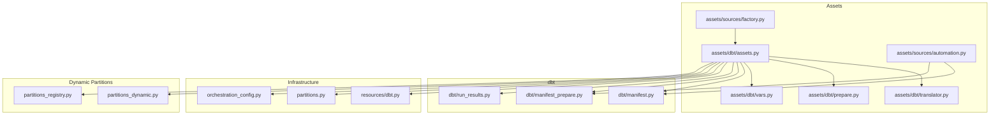
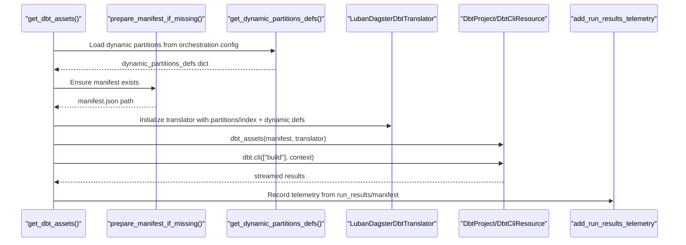
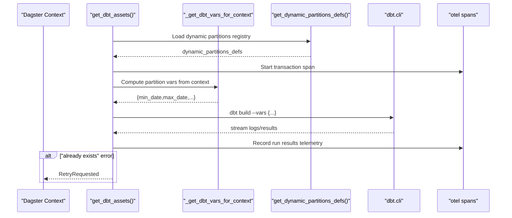
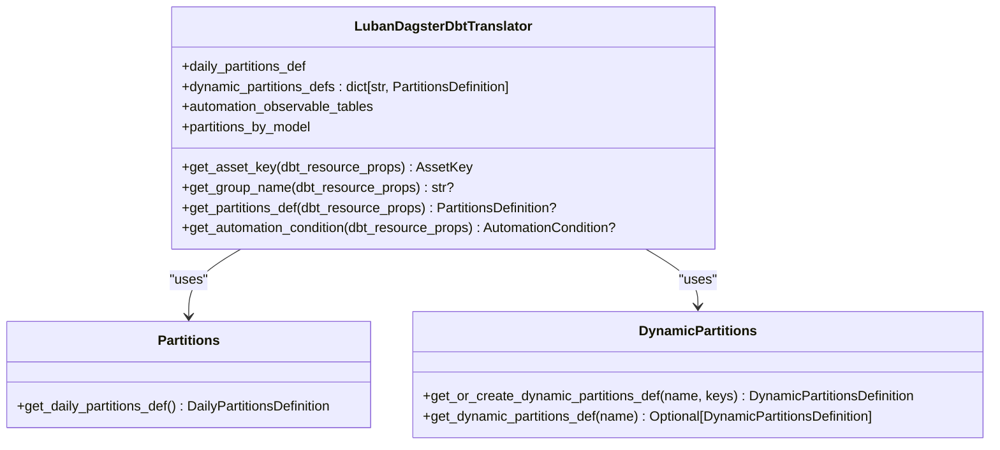
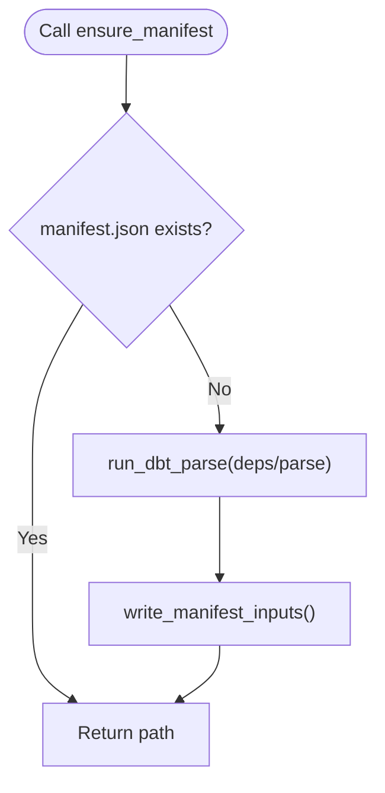
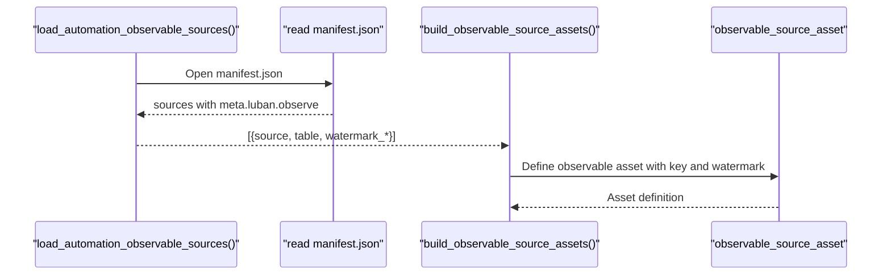
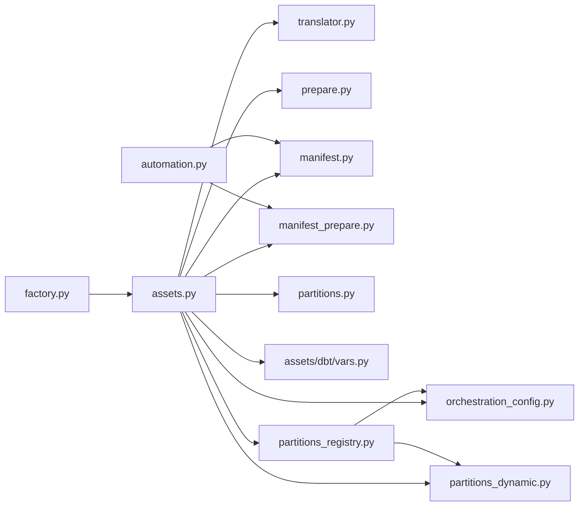

# Asset Generation

<cite>
**Referenced Files in This Document**
- [assets.py](file://src/dbt_dagsterizer/assets/dbt/assets.py)
- [translator.py](file://src/dbt_dagsterizer/assets/dbt/translator.py)
- [prepare.py](file://src/dbt_dagsterizer/assets/dbt/prepare.py)
- [factory.py](file://src/dbt_dagsterizer/assets/sources/factory.py)
- [automation.py](file://src/dbt_dagsterizer/assets/sources/automation.py)
- [manifest.py](file://src/dbt_dagsterizer/dbt/manifest.py)
- [manifest_prepare.py](file://src/dbt_dagsterizer/dbt/manifest_prepare.py)
- [partitions.py](file://src/dbt_dagsterizer/partitions.py)
- [partitions_dynamic.py](file://src/dbt_dagsterizer/partitions_dynamic.py)
- [partitions_registry.py](file://src/dbt_dagsterizer/partitions_registry.py)
- [orchestration_config.py](file://src/dbt_dagsterizer/orchestration_config.py)
- [run_results.py](file://src/dbt_dagsterizer/dbt/run_results.py)
- [dbt.py](file://src/dbt_dagsterizer/resources/dbt.py)
- [vars.py](file://src/dbt_dagsterizer/assets/dbt/vars.py)
- [test_assets_retry.py](file://tests/test_assets_retry.py)
- [test_observable_sources.py](file://tests/test_observable_sources.py)
- [test_dynamic_partitions.py](file://tests/test_dynamic_partitions.py)
</cite>

## Update Summary
**Changes Made**
- Enhanced dynamic partition support documentation with comprehensive configuration examples
- Updated translator section to reflect improved partition resolution logic for dynamic partitions
- Added detailed coverage of dynamic partition registry and initialization process
- Expanded partitioning documentation with practical dynamic partition configuration scenarios
- Updated architecture diagrams to show dynamic partition integration flow

## Table of Contents
1. [Introduction](#introduction)
2. [Project Structure](#project-structure)
3. [Core Components](#core-components)
4. [Architecture Overview](#architecture-overview)
5. [Detailed Component Analysis](#detailed-component-analysis)
6. [Dynamic Partition Support](#dynamic-partition-support)
7. [Dependency Analysis](#dependency-analysis)
8. [Performance Considerations](#performance-considerations)
9. [Troubleshooting Guide](#troubleshooting-guide)
10. [Conclusion](#conclusion)
11. [Appendices](#appendices)

## Introduction
This document explains how dbt manifests are translated into Dagster assets, covering asset key generation, dependency mapping, metadata extraction, and observable source integration. It documents how different dbt model types (incremental, table, view, seed) are handled conceptually, how partitioning and automation conditions are inferred, and how asset preparation ensures manifests are ready before asset definition. The document now includes comprehensive coverage of dynamic partition support, enabling arbitrary (non-time-based) partition dimensions like country codes, tenant IDs, and other categorical data.

## Project Structure
The asset generation pipeline centers around three primary areas:
- dbt-to-Dagster asset translation and runtime execution
- Observable source asset creation from dbt source metadata
- Manifest preparation and orchestration configuration
- Dynamic partition management and registration



**Diagram sources**
- [assets.py:40-113](file://src/dbt_dagsterizer/assets/dbt/assets.py#L40-L113)
- [translator.py:44-116](file://src/dbt_dagsterizer/assets/dbt/translator.py#L44-L116)
- [prepare.py:9-18](file://src/dbt_dagsterizer/assets/dbt/prepare.py#L9-L18)
- [vars.py:25-39](file://src/dbt_dagsterizer/assets/dbt/vars.py#L25-L39)
- [factory.py:13-86](file://src/dbt_dagsterizer/assets/sources/factory.py#L13-L86)
- [automation.py:15-47](file://src/dbt_dagsterizer/assets/sources/automation.py#L15-L47)
- [manifest.py:28-64](file://src/dbt_dagsterizer/dbt/manifest.py#L28-L64)
- [manifest_prepare.py:57-72](file://src/dbt_dagsterizer/dbt/manifest_prepare.py#L57-L72)
- [run_results.py:223-335](file://src/dbt_dagsterizer/dbt/run_results.py#L223-L335)
- [dbt.py:27-95](file://src/dbt_dagsterizer/resources/dbt.py#L27-L95)
- [partitions.py:10-21](file://src/dbt_dagsterizer/partitions.py#L10-L21)
- [partitions_dynamic.py:1-128](file://src/dbt_dagsterizer/partitions_dynamic.py#L1-L128)
- [partitions_registry.py:1-85](file://src/dbt_dagsterizer/partitions_registry.py#L1-L85)
- [orchestration_config.py:112-158](file://src/dbt_dagsterizer/orchestration_config.py#L112-L158)

**Section sources**
- [assets.py:40-113](file://src/dbt_dagsterizer/assets/dbt/assets.py#L40-L113)
- [translator.py:44-116](file://src/dbt_dagsterizer/assets/dbt/translator.py#L44-L116)
- [prepare.py:9-18](file://src/dbt_dagsterizer/assets/dbt/prepare.py#L9-L18)
- [factory.py:13-86](file://src/dbt_dagsterizer/assets/sources/factory.py#L13-L86)
- [automation.py:15-47](file://src/dbt_dagsterizer/assets/sources/automation.py#L15-L47)
- [manifest.py:28-64](file://src/dbt_dagsterizer/dbt/manifest.py#L28-L64)
- [manifest_prepare.py:57-72](file://src/dbt_dagsterizer/dbt/manifest_prepare.py#L57-L72)
- [run_results.py:223-335](file://src/dbt_dagsterizer/dbt/run_results.py#L223-L335)
- [dbt.py:27-95](file://src/dbt_dagsterizer/resources/dbt.py#L27-L95)
- [partitions.py:10-21](file://src/dbt_dagsterizer/partitions.py#L10-L21)
- [partitions_dynamic.py:1-128](file://src/dbt_dagsterizer/partitions_dynamic.py#L1-L128)
- [partitions_registry.py:1-85](file://src/dbt_dagsterizer/partitions_registry.py#L1-L85)
- [orchestration_config.py:112-158](file://src/dbt_dagsterizer/orchestration_config.py#L112-L158)

## Core Components
- Asset definition and runtime: The dbt assets decorator is configured with a translator and a prepared manifest. It streams dbt CLI execution, injects partition variables, and records telemetry.
- Translator: Provides asset keys, groups, partitions, and automation conditions based on dbt resource properties and orchestration configuration. Now includes dynamic partition support through the `dynamic_partitions_defs` parameter.
- Manifest preparation: Ensures a fresh dbt manifest exists before asset loading, optionally invoking deps and parse.
- Observable sources: Reads dbt source metadata to define observable source assets that track watermark columns or SQL expressions.
- Partitioning: Supplies both daily partitions definition and dynamic partitions definitions when requested by the translator.
- Orchestration index: Indexes partition types and job assignments for models from a YAML configuration, including dynamic partition configurations.

**Section sources**
- [assets.py:40-113](file://src/dbt_dagsterizer/assets/dbt/assets.py#L40-L113)
- [translator.py:44-116](file://src/dbt_dagsterizer/assets/dbt/translator.py#L44-L116)
- [prepare.py:9-18](file://src/dbt_dagsterizer/assets/dbt/prepare.py#L9-L18)
- [factory.py:13-86](file://src/dbt_dagsterizer/assets/sources/factory.py#L13-L86)
- [automation.py:15-47](file://src/dbt_dagsterizer/assets/sources/automation.py#L15-L47)
- [partitions.py:10-21](file://src/dbt_dagsterizer/partitions.py#L10-L21)
- [partitions_dynamic.py:1-128](file://src/dbt_dagsterizer/partitions_dynamic.py#L1-L128)
- [partitions_registry.py:1-85](file://src/dbt_dagsterizer/partitions_registry.py#L1-L85)
- [orchestration_config.py:112-158](file://src/dbt_dagsterizer/orchestration_config.py#L112-L158)

## Architecture Overview
The asset generation pipeline integrates dbt's manifest with Dagster's asset graph through a translator and runtime execution, now enhanced with dynamic partition support.



**Diagram sources**
- [assets.py:40-113](file://src/dbt_dagsterizer/assets/dbt/assets.py#L40-L113)
- [prepare.py:9-18](file://src/dbt_dagsterizer/assets/dbt/prepare.py#L9-L18)
- [partitions_registry.py:55-74](file://src/dbt_dagsterizer/partitions_registry.py#L55-L74)
- [translator.py:44-116](file://src/dbt_dagsterizer/assets/dbt/translator.py#L44-L116)
- [run_results.py:223-335](file://src/dbt_dagsterizer/dbt/run_results.py#L223-L335)

## Detailed Component Analysis

### Asset Definition and Runtime Execution
- Loads dbt project directory and target, prepares manifest, and constructs a translator with automation tables, partition index, and dynamic partition definitions.
- Defines a dbt assets asset sensor that streams dbt CLI output, injects partition variables when present, and records telemetry.
- Implements a retry policy for specific dbt CLI errors indicating "already exists."



**Diagram sources**
- [assets.py:71-113](file://src/dbt_dagsterizer/assets/dbt/assets.py#L71-L113)
- [vars.py:25-39](file://src/dbt_dagsterizer/assets/dbt/vars.py#L25-L39)
- [partitions_registry.py:55-74](file://src/dbt_dagsterizer/partitions_registry.py#L55-L74)
- [run_results.py:223-335](file://src/dbt_dagsterizer/dbt/run_results.py#L223-L335)

**Section sources**
- [assets.py:40-113](file://src/dbt_dagsterizer/assets/dbt/assets.py#L40-L113)
- [vars.py:25-39](file://src/dbt_dagsterizer/assets/dbt/vars.py#L25-L39)
- [test_assets_retry.py:4-14](file://tests/test_assets_retry.py#L4-L14)

### Translator: Asset Keys, Groups, Partitions, Automation Conditions
- Asset key generation: Builds a relation-based key using database, schema, and identifier to ensure stability across code locations.
- Group naming: Infers group names from the model's original file path or FQN.
- Partitions: Returns partition definitions based on model partition type specifications, supporting daily, dynamic, and unpartitioned models.
- Automation conditions: Eager automation for specific model families/tags and automation observable tables.

**Updated** The translator now supports dynamic partitions through the `dynamic_partitions_defs` parameter and partition type specifications in the format "dynamic:name".



**Diagram sources**
- [translator.py:44-116](file://src/dbt_dagsterizer/assets/dbt/translator.py#L44-L116)
- [partitions.py:10-21](file://src/dbt_dagsterizer/partitions.py#L10-L21)
- [partitions_dynamic.py:18-52](file://src/dbt_dagsterizer/partitions_dynamic.py#L18-L52)

**Section sources**
- [translator.py:44-116](file://src/dbt_dagsterizer/assets/dbt/translator.py#L44-L116)
- [partitions.py:10-21](file://src/dbt_dagsterizer/partitions.py#L10-L21)
- [partitions_dynamic.py:18-52](file://src/dbt_dagsterizer/partitions_dynamic.py#L18-L52)
- [orchestration_config.py:112-158](file://src/dbt_dagsterizer/orchestration_config.py#L112-L158)

### Manifest Preparation and Loading
- Ensures a manifest exists by running dbt deps and parse when needed, respecting environment and .env overrides.
- Loads manifest and iterates dbt models, extracting name, tags, meta, and relation properties.



**Diagram sources**
- [manifest_prepare.py:57-72](file://src/dbt_dagsterizer/dbt/manifest_prepare.py#L57-L72)
- [manifest.py:28-64](file://src/dbt_dagsterizer/dbt/manifest.py#L28-L64)

**Section sources**
- [manifest_prepare.py:57-72](file://src/dbt_dagsterizer/dbt/manifest_prepare.py#L57-L72)
- [manifest.py:28-64](file://src/dbt_dagsterizer/dbt/manifest.py#L28-L64)

### Observable Source Assets and Automation
- Loads observable source specs from dbt manifest sources that include watermark metadata.
- Creates observable source assets keyed by matching dbt output names, supporting either watermark column or custom watermark SQL.
- Resolves asset keys by exact table match or suffix-based fallback.



**Diagram sources**
- [automation.py:15-47](file://src/dbt_dagsterizer/assets/sources/automation.py#L15-L47)
- [factory.py:13-86](file://src/dbt_dagsterizer/assets/sources/factory.py#L13-L86)

**Section sources**
- [automation.py:15-47](file://src/dbt_dagsterizer/assets/sources/automation.py#L15-L47)
- [factory.py:13-86](file://src/dbt_dagsterizer/assets/sources/factory.py#L13-L86)
- [test_observable_sources.py:10-63](file://tests/test_observable_sources.py#L10-L63)

### Asset Key Patterns and Dependency Mapping
- Asset keys are relation-based: dbt/<database>/<schema>/<identifier>, with empty components omitted.
- Group names are derived from the model's file path or FQN to organize assets under logical folders.
- Dependencies are inferred by Dagster from the dbt manifest and translator configuration.

Examples (conceptual):
- Asset key pattern: dbt/ods/orders
- Group derivation: models/dwd/customers → group "dwd"
- Dependency chain: incremental model depends on upstream table/view seeds

**Section sources**
- [translator.py:12-42](file://src/dbt_dagsterizer/assets/dbt/translator.py#L12-L42)
- [translator.py:88-106](file://src/dbt_dagsterizer/assets/dbt/translator.py#L88-L106)

### Metadata Extraction and Enrichment
- dbt manifest metadata is loaded and indexed to extract tags, meta, and resource properties.
- Luban-specific metadata is used for partitioning hints and automation configuration.
- Telemetry enriches spans with dbt run results and manifest node details.

**Section sources**
- [manifest.py:76-93](file://src/dbt_dagsterizer/dbt/manifest.py#L76-L93)
- [run_results.py:223-335](file://src/dbt_dagsterizer/dbt/run_results.py#L223-L335)

### Asset Translation Process by Model Type
- Table, View, Seed, Incremental: The translator treats models uniformly by resource type and uses tags/FQN to infer automation and grouping. Partitioning is applied when configured.
- The dbt CLI command executed is build, which compiles and runs models according to the manifest.

**Section sources**
- [assets.py:71-93](file://src/dbt_dagsterizer/assets/dbt/assets.py#L71-L93)
- [translator.py:88-116](file://src/dbt_dagsterizer/assets/dbt/translator.py#L88-L116)

## Dynamic Partition Support

### Dynamic Partition Management
The system now supports dynamic partitions for arbitrary (non-time-based) partition dimensions. Dynamic partitions are managed through a centralized registry that loads configurations from the orchestration file.

**Updated** The dynamic partition system includes three core components:
- `partitions_dynamic.py`: Manages creation, caching, and runtime updates of DynamicPartitionsDefinition objects
- `partitions_registry.py`: Centralized initialization and access to dynamic partition definitions from orchestration config
- `DynamicPartitionConfig`: Data structure defining dynamic partition specifications with name and initial partition keys

### Dynamic Partition Configuration
Dynamic partitions are configured in the orchestration file (`dagsterization.yml`) under the `partitions.dynamic` section. Each dynamic partition requires:
- `name`: Unique identifier for the partition dimension (e.g., "country_code", "tenant_id")
- `initial_partition_keys`: List of initial partition key values
- Models assigned to dynamic partitions use the format "dynamic:name" in the partition specification

**Updated** The orchestration configuration system now supports comprehensive dynamic partition management:
- Parsing of `partitions.dynamic` section with multiple partition definitions
- Assignment of models to specific dynamic partitions
- Validation and management of dynamic partition configurations
- Integration with job and schedule factories for dynamic partition execution

### Dynamic Partition Resolution
The translator resolves partition definitions based on model partition type specifications:
- `"daily"`: Returns the configured daily partitions definition
- `"dynamic:name"`: Returns the corresponding DynamicPartitionsDefinition from the registry
- `"unpartitioned"` or `None`: Returns None (no partitioning)

**Important**: The translator intentionally returns None for individual models to preserve asset lineage across different partition types. Partitioning is handled at the job/schedule level rather than at the asset definition level.

### Runtime Partition Key Management
Dynamic partition keys are managed at runtime through the Dagster instance:
- Initial partition keys are provided during registry initialization
- Partition keys can be updated dynamically using `update_dynamic_partition_keys()`
- The system maintains backward compatibility with existing partition key states

**Updated** The dynamic partition registry provides centralized management:
- Global caching of dynamic partition definitions for performance
- Lazy initialization from orchestration configuration
- Reset functionality for testing and development environments
- Consistent access pattern across all components (assets, jobs, schedules, sensors)

**Section sources**
- [translator.py:110-139](file://src/dbt_dagsterizer/assets/dbt/translator.py#L110-L139)
- [partitions_dynamic.py:18-52](file://src/dbt_dagsterizer/partitions_dynamic.py#L18-L52)
- [partitions_registry.py:26-52](file://src/dbt_dagsterizer/partitions_registry.py#L26-L52)
- [orchestration_config.py:112-158](file://src/dbt_dagsterizer/orchestration_config.py#L112-L158)
- [test_dynamic_partitions.py:154-200](file://tests/test_dynamic_partitions.py#L154-L200)

## Dependency Analysis
The asset generation module exhibits low coupling and clear separation of concerns, now enhanced with dynamic partition support:
- assets.py orchestrates loading, preparation, translation, execution, and dynamic partition registry loading.
- translator.py encapsulates key/group/partition/automation logic, including dynamic partition handling.
- manifest.py and manifest_prepare.py handle manifest lifecycle.
- partitions.py supplies daily partition definitions.
- partitions_dynamic.py manages dynamic partition creation and caching.
- partitions_registry.py provides centralized dynamic partition initialization from orchestration config.
- orchestration_config.py provides model-to-partition and job mappings, including dynamic partition configurations.
- factory.py and automation.py integrate observable sources from dbt metadata.



**Diagram sources**
- [assets.py:40-113](file://src/dbt_dagsterizer/assets/dbt/assets.py#L40-L113)
- [translator.py:44-116](file://src/dbt_dagsterizer/assets/dbt/translator.py#L44-L116)
- [prepare.py:9-18](file://src/dbt_dagsterizer/assets/dbt/prepare.py#L9-L18)
- [manifest.py:28-64](file://src/dbt_dagsterizer/dbt/manifest.py#L28-L64)
- [manifest_prepare.py:57-72](file://src/dbt_dagsterizer/dbt/manifest_prepare.py#L57-L72)
- [partitions.py:10-21](file://src/dbt_dagsterizer/partitions.py#L10-L21)
- [partitions_dynamic.py:1-128](file://src/dbt_dagsterizer/partitions_dynamic.py#L1-L128)
- [partitions_registry.py:1-85](file://src/dbt_dagsterizer/partitions_registry.py#L1-L85)
- [orchestration_config.py:112-158](file://src/dbt_dagsterizer/orchestration_config.py#L112-L158)
- [factory.py:13-86](file://src/dbt_dagsterizer/assets/sources/factory.py#L13-L86)
- [automation.py:15-47](file://src/dbt_dagsterizer/assets/sources/automation.py#L15-L47)

**Section sources**
- [assets.py:40-113](file://src/dbt_dagsterizer/assets/dbt/assets.py#L40-L113)
- [translator.py:44-116](file://src/dbt_dagsterizer/assets/dbt/translator.py#L44-L116)
- [prepare.py:9-18](file://src/dbt_dagsterizer/assets/dbt/prepare.py#L9-L18)
- [manifest.py:28-64](file://src/dbt_dagsterizer/dbt/manifest.py#L28-L64)
- [manifest_prepare.py:57-72](file://src/dbt_dagsterizer/dbt/manifest_prepare.py#L57-L72)
- [partitions.py:10-21](file://src/dbt_dagsterizer/partitions.py#L10-L21)
- [partitions_dynamic.py:1-128](file://src/dbt_dagsterizer/partitions_dynamic.py#L1-L128)
- [partitions_registry.py:1-85](file://src/dbt_dagsterizer/partitions_registry.py#L1-L85)
- [orchestration_config.py:112-158](file://src/dbt_dagsterizer/orchestration_config.py#L112-L158)
- [factory.py:13-86](file://src/dbt_dagsterizer/assets/sources/factory.py#L13-L86)
- [automation.py:15-47](file://src/dbt_dagsterizer/assets/sources/automation.py#L15-L47)

## Performance Considerations
- Manifest preparation: Running dbt deps and parse adds overhead; caching and environment checks prevent unnecessary work.
- Partition variables: Injecting time windows avoids scanning entire datasets when partitions are used.
- Telemetry: Recording run results and manifest nodes enriches observability but should be tuned via environment variables to avoid excessive event volume.
- Dynamic partition caching: Dynamic partitions are cached globally to avoid repeated creation overhead and maintain consistent partition definitions across the application.

## Troubleshooting Guide
- Manifest not found: Ensure DBT_PROJECT_DIR or LUBAN_REPO_ROOT is set correctly so dbt project/profiles discovery succeeds.
- Missing daily partitions start date: When using daily partitions, set DAGSTER_DAILY_PARTITIONS_START_DATE.
- Retry on "already exists": The runtime retries once for specific dbt CLI errors; verify idempotency of downstream steps.
- Observable source resolution: If asset key resolution fails, confirm the source/table mapping and available output names.
- Dynamic partition configuration: Ensure dynamic partition names in orchestration config match the "dynamic:name" format and that partition keys are properly initialized.
- Mixed partition types: When using dynamic partitions, ensure all models in the same @dbt_assets have the same partition type to avoid lineage conflicts.

**Section sources**
- [dbt.py:27-95](file://src/dbt_dagsterizer/resources/dbt.py#L27-L95)
- [partitions.py:14-18](file://src/dbt_dagsterizer/partitions.py#L14-L18)
- [assets.py:94-101](file://src/dbt_dagsterizer/assets/dbt/assets.py#L94-L101)
- [factory.py:31-44](file://src/dbt_dagsterizer/assets/sources/factory.py#L31-L44)
- [partitions_dynamic.py:38-41](file://src/dbt_dagsterizer/partitions_dynamic.py#L38-L41)
- [test_dynamic_partitions.py:75-90](file://tests/test_dynamic_partitions.py#L75-L90)

## Conclusion
The asset generation pipeline converts dbt manifests into a Dagster asset graph by translating dbt resource properties into asset keys, groups, partitions, and automation conditions. Manifest preparation, partition variable injection, and telemetry ensure robust and observable execution. Observable sources are automatically created from dbt source metadata, enabling watermark-driven asset updates. Orchestration configuration provides a declarative way to manage partitions and job assignments. The enhanced dynamic partition support enables flexible, arbitrary partition dimensions for complex business scenarios while maintaining asset lineage integrity.

## Appendices

### Appendix A: Asset Key Pattern Reference
- Relation-based key: dbt/<database>/<schema>/<identifier>
- Empty components are omitted; examples:
  - dbt/ods/orders
  - dbt/schema/clients
  - dbt/my_table

**Section sources**
- [translator.py:12-42](file://src/dbt_dagsterizer/assets/dbt/translator.py#L12-L42)

### Appendix B: Dependency Chain Example
- Seed → View → Table
- Incremental model depends on upstream materialized tables or views

**Section sources**
- [translator.py:88-106](file://src/dbt_dagsterizer/assets/dbt/translator.py#L88-L106)

### Appendix C: Metadata Enrichment Examples
- Partition type: daily/unpartitioned/dynamic:name per model
- Automation condition: eager for specific model families/tags and automation observable tables
- Grouping: derived from file path or FQN

**Section sources**
- [orchestration_config.py:112-158](file://src/dbt_dagsterizer/orchestration_config.py#L112-L158)
- [translator.py:58-80](file://src/dbt_dagsterizer/assets/dbt/translator.py#L58-L80)

### Appendix D: Dynamic Partition Configuration Examples
- Daily partition: `"daily"` in orchestration config
- Dynamic partition: `"dynamic:country_code"` with initial keys `["US", "GB", "DE"]`
- Mixed partition types: Not supported within the same @dbt_assets decorator

**Updated** Practical configuration examples for dynamic partitions:

**Basic Dynamic Partition Setup**
```yaml
partitions:
  daily:
    - staging_orders
  
  dynamic:
    - name: country_code
      initial_partition_keys: ['US', 'GB', 'DE', 'JP', 'AU']
      models: 
        - orders_by_country
    
    - name: tenant_id
      initial_partition_keys: ['tenant_001', 'tenant_002', 'tenant_003']
      models: 
        - tenant_reports
  
  unpartitioned:
    - dim_calendar

jobs:
  orders_by_country_job:
    models: [fact_orders_by_country]
    partitions: dynamic:country_code
    include_upstream: true
  
  tenant_reports_job:
    models: [fact_tenant_reports]
    partitions: dynamic:tenant_id
    include_upstream: false
```

**Advanced Configuration with Multiple Dynamic Partitions**
```yaml
partitions:
  dynamic:
    - name: region
      initial_partition_keys: ['APAC', 'EMEA', 'AMERICAS']
      models: 
        - sales_by_region
        - marketing_by_region
    
    - name: product_category
      initial_partition_keys: ['electronics', 'clothing', 'home']
      models:
        - inventory_by_category
        - demand_forecast_by_category

jobs:
  regional_sales_job:
    models: [sales_by_region, marketing_by_region]
    partitions: dynamic:region
    include_upstream: true
  
  category_inventory_job:
    models: [inventory_by_category, demand_forecast_by_category]
    partitions: dynamic:product_category
    include_upstream: true
```

**Section sources**
- [orchestration_config.py:137-159](file://src/dbt_dagsterizer/orchestration_config.py#L137-L159)
- [translator.py:134-136](file://src/dbt_dagsterizer/assets/dbt/translator.py#L134-L136)
- [test_dynamic_partitions.py:95-120](file://tests/test_dynamic_partitions.py#L95-L120)
- [IMPLEMENTATION_SUMMARY.md:176-219](file://IMPLEMENTATION_SUMMARY.md#L176-L219)