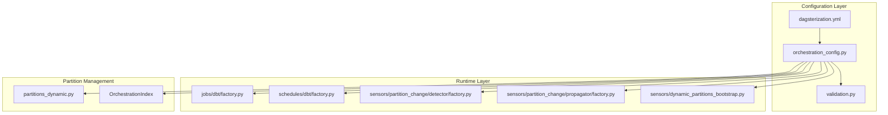
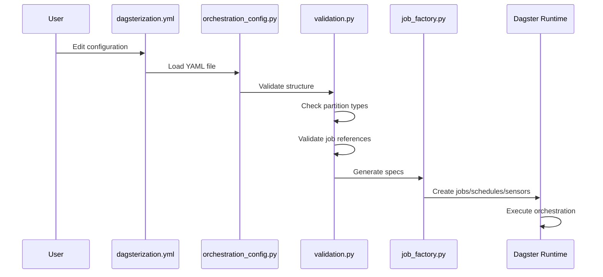
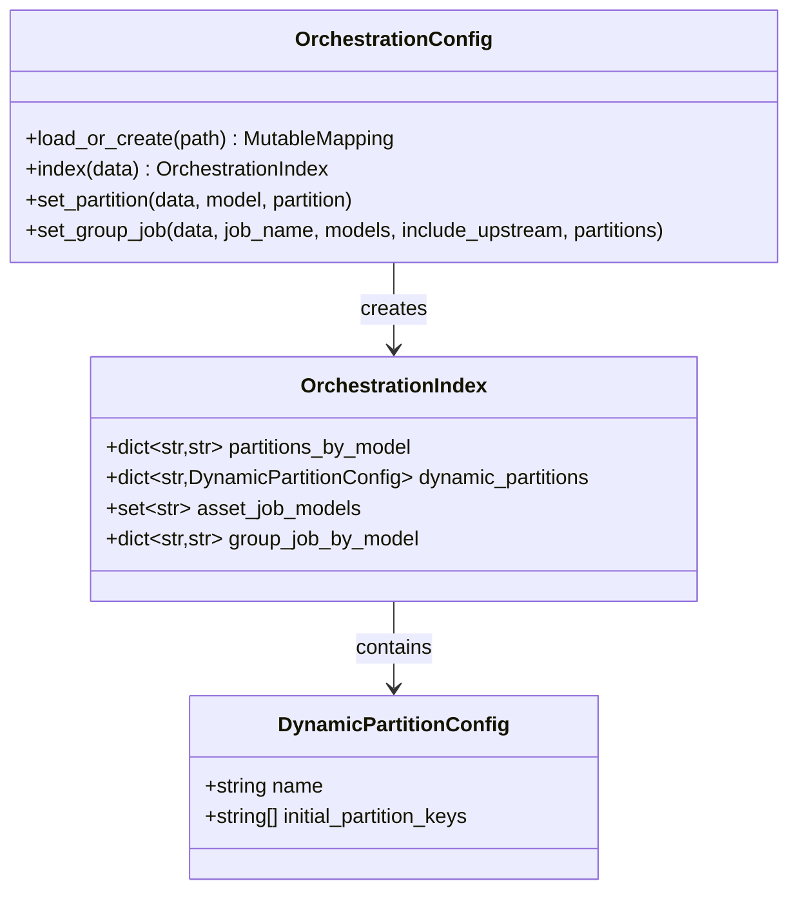
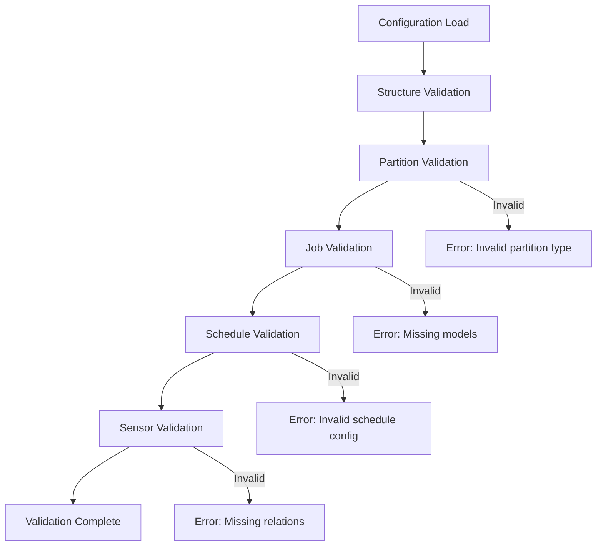
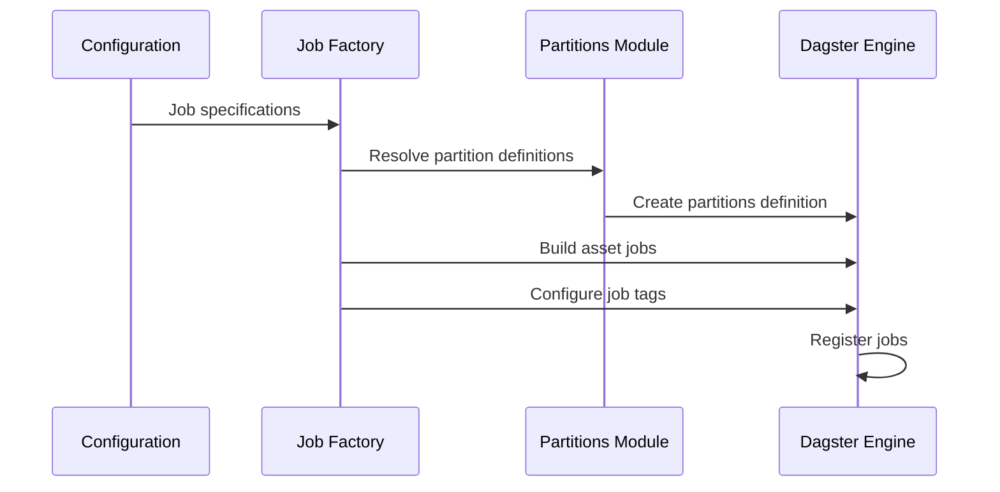
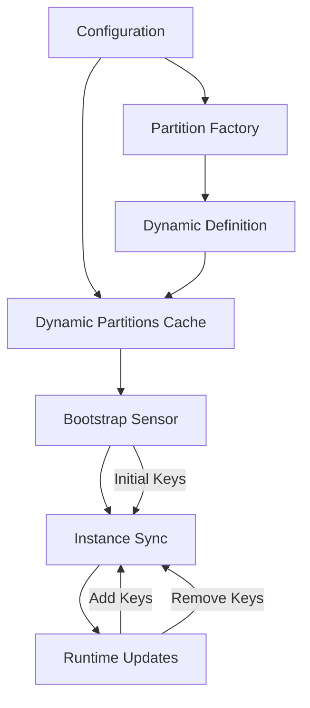
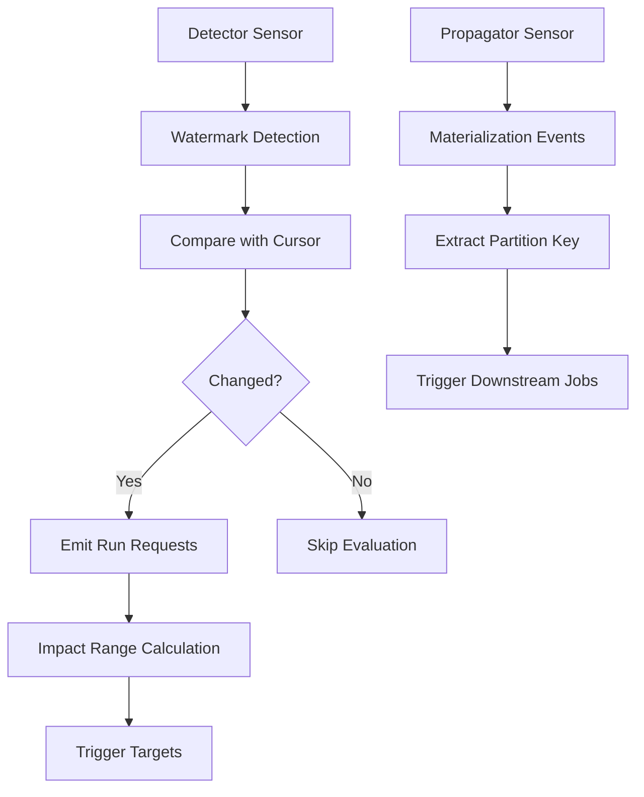
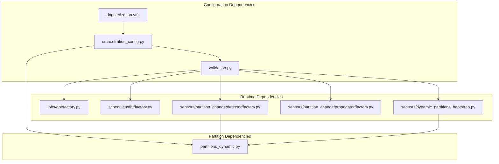

# Dagsterization YAML Configuration

<cite>
**Referenced Files in This Document**
- [dagsterization.yml](file://src/dbt_dagsterizer/project_templates/luban-dagster-dbt-starrocks-code-location-source-template/{{cookiecutter.output_name}}/dbt_project/dagsterization.yml)
- [dagsterization-yml.md](file://docs/concepts/dagsterization-yml.md)
- [orchestration_config.py](file://src/dbt_dagsterizer/orchestration_config.py)
- [validation.py](file://src/dbt_dagsterizer/cli_parts/validation.py)
- [meta.py](file://src/dbt_dagsterizer/cli_parts/meta.py)
- [factory.py](file://src/dbt_dagsterizer/jobs/dbt/factory.py)
- [factory.py](file://src/dbt_dagsterizer/schedules/dbt/factory.py)
- [factory.py](file://src/dbt_dagsterizer/sensors/partition_change/detector/factory.py)
- [factory.py](file://src/dbt_dagsterizer/sensors/partition_change/propagator/factory.py)
- [dynamic_partitions_bootstrap.py](file://src/dbt_dagsterizer/sensors/dynamic_partitions_bootstrap.py)
- [partitions_dynamic.py](file://src/dbt_dagsterizer/partitions_dynamic.py)
</cite>

## Table of Contents
1. [Introduction](#introduction)
2. [Project Structure](#project-structure)
3. [Core Components](#core-components)
4. [Architecture Overview](#architecture-overview)
5. [Detailed Component Analysis](#detailed-component-analysis)
6. [Dependency Analysis](#dependency-analysis)
7. [Performance Considerations](#performance-considerations)
8. [Troubleshooting Guide](#troubleshooting-guide)
9. [Conclusion](#conclusion)

## Introduction
This document provides comprehensive documentation for the Dagsterization YAML Configuration system used by dbt-dagsterizer. The `dagsterization.yml` file serves as the single source of truth for Dagster orchestration intent in dbt projects, bridging dbt metadata with Dagster orchestration through partitioning strategies, job definitions, schedules, and partition change sensors.

The configuration system enables declarative orchestration of dbt models in Dagster, supporting both time-based daily partitions and flexible dynamic partitions for non-temporal dimensions like country codes or tenant IDs.

## Project Structure
The Dagsterization YAML configuration system is organized around several key components:



**Diagram sources**
- [dagsterization.yml:1-48](file://src/dbt_dagsterizer/project_templates/luban-dagster-dbt-starrocks-code-location-source-template/{{cookiecutter.output_name}}/dbt_project/dagsterization.yml#L1-L48)
- [orchestration_config.py:120-191](file://src/dbt_dagsterizer/orchestration_config.py#L120-L191)
- [validation.py:22-212](file://src/dbt_dagsterizer/cli_parts/validation.py#L22-L212)

**Section sources**
- [dagsterization.yml:1-48](file://src/dbt_dagsterizer/project_templates/luban-dagster-dbt-starrocks-code-location-source-template/{{cookiecutter.output_name}}/dbt_project/dagsterization.yml#L1-L48)
- [dagsterization-yml.md:1-636](file://docs/concepts/dagsterization-yml.md#L1-L636)

## Core Components

### Configuration File Structure
The `dagsterization.yml` file follows a hierarchical structure with five primary sections:

```mermaid
flowchart TD
ROOT[dagsterization.yml Root] --> VERSION[version: 1]
VERSION --> PARTITIONS[partitions Section]
VERSION --> JOBS[jobs Section]
VERSION --> ASSET_JOBS[asset_jobs Section]
VERSION --> SCHEDULES[schedules Section]
VERSION --> PARTITION_CHANGE[partition_change Section]
PARTITIONS --> DAILY[daily: model lists]
PARTITIONS --> DYNAMIC[dynamic: partition definitions]
JOBS --> JOB1[job_name: {models, include_upstream, partitions}]
ASSET_JOBS --> ASSET_LIST[Model names as strings]
SCHEDULES --> SCHEDULE1[schedule_name: {type, job_name, hour, minute, lookback_days, offset_days, enabled}]
PARTITION_CHANGE --> DETECTORS1[detectors: sensor configurations]
PARTITION_CHANGE --> PROPAGATORS1[propagators: downstream triggers]
```

**Diagram sources**
- [dagsterization.yml:1-48](file://src/dbt_dagsterizer/project_templates/luban-dagster-dbt-starrocks-code-location-source-template/{{cookiecutter.output_name}}/dbt_project/dagsterization.yml#L1-L48)
- [dagsterization-yml.md:27-53](file://docs/concepts/dagsterization-yml.md#L27-L53)

### Partition Types and Constraints
The system supports three primary partition types with strict isolation requirements:

| Partition Type | Description | Environment Variables | Asset Group Isolation |
|---|---|---|---|
| `daily` | One partition per day | `DAGSTER_DAILY_PARTITIONS_START_DATE`, `DAGSTER_PARTITION_TIMEZONE` | ✅ Separate group |
| `dynamic` | Custom partition keys (e.g., country codes) | N/A (defined inline) | ✅ Separate group (per name) |
| `unpartitioned` | No partitioning | N/A | ✅ Separate group |

**Section sources**
- [dagsterization-yml.md:69-130](file://docs/concepts/dagsterization-yml.md#L69-L130)

## Architecture Overview

The Dagsterization YAML Configuration system implements a multi-layered architecture that transforms declarative configuration into executable Dagster orchestration:



**Diagram sources**
- [orchestration_config.py:30-75](file://src/dbt_dagsterizer/orchestration_config.py#L30-L75)
- [validation.py:22-212](file://src/dbt_dagsterizer/cli_parts/validation.py#L22-L212)
- [factory.py:84-127](file://src/dbt_dagsterizer/jobs/dbt/factory.py#L84-L127)

## Detailed Component Analysis

### Orchestration Configuration Loading
The configuration loading system provides robust YAML parsing with default value handling:



**Diagram sources**
- [orchestration_config.py:112-191](file://src/dbt_dagsterizer/orchestration_config.py#L112-L191)
- [orchestration_config.py:1-16](file://src/dbt_dagsterizer/orchestration_config.py#L1-L16)

### Validation System
The validation system enforces configuration integrity through comprehensive checks:



**Diagram sources**
- [validation.py:22-212](file://src/dbt_dagsterizer/cli_parts/validation.py#L22-L212)
- [validation.py:215-320](file://src/dbt_dagsterizer/cli_parts/validation.py#L215-L320)

**Section sources**
- [validation.py:22-212](file://src/dbt_dagsterizer/cli_parts/validation.py#L22-L212)
- [validation.py:215-320](file://src/dbt_dagsterizer/cli_parts/validation.py#L215-L320)

### Job Factory Implementation
The job factory transforms configuration into executable Dagster jobs:



**Diagram sources**
- [factory.py:84-127](file://src/dbt_dagsterizer/jobs/dbt/factory.py#L84-L127)
- [factory.py:12-28](file://src/dbt_dagsterizer/jobs/dbt/factory.py#L12-L28)

**Section sources**
- [factory.py:84-127](file://src/dbt_dagsterizer/jobs/dbt/factory.py#L84-L127)

### Dynamic Partitions Management
Dynamic partitions provide flexible non-temporal partitioning capabilities:



**Diagram sources**
- [dynamic_partitions_bootstrap.py:39-122](file://src/dbt_dagsterizer/sensors/dynamic_partitions_bootstrap.py#L39-L122)
- [partitions_dynamic.py:18-52](file://src/dbt_dagsterizer/partitions_dynamic.py#L18-L52)

**Section sources**
- [dynamic_partitions_bootstrap.py:39-122](file://src/dbt_dagsterizer/sensors/dynamic_partitions_bootstrap.py#L39-L122)
- [partitions_dynamic.py:18-52](file://src/dbt_dagsterizer/partitions_dynamic.py#L18-L52)

### Partition Change Sensors
The system implements sophisticated sensors for handling late arrivals and data updates:



**Diagram sources**
- [factory.py:85-195](file://src/dbt_dagsterizer/sensors/partition_change/detector/factory.py#L85-L195)
- [factory.py:42-142](file://src/dbt_dagsterizer/sensors/partition_change/propagator/factory.py#L42-L142)

**Section sources**
- [factory.py:85-195](file://src/dbt_dagsterizer/sensors/partition_change/detector/factory.py#L85-L195)
- [factory.py:42-142](file://src/dbt_dagsterizer/sensors/partition_change/propagator/factory.py#L42-L142)

## Dependency Analysis

The configuration system exhibits clear separation of concerns with well-defined dependencies:



**Diagram sources**
- [orchestration_config.py:1-91](file://src/dbt_dagsterizer/orchestration_config.py#L1-L91)
- [validation.py:1-200](file://src/dbt_dagsterizer/cli_parts/validation.py#L1-L200)

**Section sources**
- [orchestration_config.py:1-91](file://src/dbt_dagsterizer/orchestration_config.py#L1-L91)
- [validation.py:1-200](file://src/dbt_dagsterizer/cli_parts/validation.py#L1-L200)

## Performance Considerations
The configuration system is designed for optimal performance through several mechanisms:

- **Lazy Loading**: Dynamic partitions are loaded on-demand rather than at startup
- **Caching**: Partition definitions are cached to avoid repeated creation
- **Efficient Validation**: Validation occurs only when configuration changes
- **Minimal Memory Footprint**: Configuration is parsed once and reused across components

## Troubleshooting Guide

### Common Configuration Issues

**Partition Type Conflicts**
- **Symptom**: `DagsterInvariantViolationError: Cannot mix partition types`
- **Cause**: Mixing different partition types in a single job
- **Solution**: Ensure each job uses models with the same partition type

**Missing Model References**
- **Symptom**: Validation errors for missing models
- **Cause**: Models referenced in configuration don't exist in dbt manifest
- **Solution**: Verify model names match dbt project structure

**Dynamic Partition Configuration Errors**
- **Symptom**: Errors for invalid dynamic partition names
- **Cause**: Unknown dynamic partition references or empty initial keys
- **Solution**: Check dynamic partition definitions in configuration

**Section sources**
- [dagsterization-yml.md:583-627](file://docs/concepts/dagsterization-yml.md#L583-L627)

## Conclusion
The Dagsterization YAML Configuration system provides a robust, declarative approach to orchestrating dbt models in Dagster. Through careful separation of concerns, comprehensive validation, and flexible partitioning strategies, it enables teams to manage complex orchestration requirements while maintaining simplicity and reliability.

The system's modular architecture allows for easy extension and customization while preserving backward compatibility and providing clear error messages for troubleshooting.