# Dbt Models Concept

<cite>
**Referenced Files in This Document**
- [dbt-models.md](file://docs/concepts/dbt-models.md)
- [assets.py](file://src/dbt_dagsterizer/assets/dbt/assets.py)
- [translator.py](file://src/dbt_dagsterizer/assets/dbt/translator.py)
- [vars.py](file://src/dbt_dagsterizer/assets/dbt/vars.py)
- [manifest.py](file://src/dbt_dagsterizer/dbt/manifest.py)
- [manifest_prepare.py](file://src/dbt_dagsterizer/dbt/manifest_prepare.py)
- [prepare.py](file://src/dbt_dagsterizer/assets/dbt/prepare.py)
- [run_results.py](file://src/dbt_dagsterizer/dbt/run_results.py)
- [orchestration_config.py](file://src/dbt_dagsterizer/orchestration_config.py)
- [orders.sql](file://src/dbt_dagsterizer/project_templates/luban-dagster-dbt-starrocks-code-location-source-template/{{cookiecutter.output_name}}/dbt_project/models/dwd/orders.sql)
- [fact_orders_daily.sql](file://src/dbt_dagsterizer/project_templates/luban-dagster-dbt-starrocks-code-location-source-template/{{cookiecutter.output_name}}/dbt_project/models/dws/fact_orders_daily.sql)
- [dim_customer.sql](file://src/dbt_dagsterizer/project_templates/luban-dagster-dbt-starrocks-code-location-source-template/{{cookiecutter.output_name}}/dbt_project/models/dws/dim_customer.sql)
- [partition_vars.sql](file://src/dbt_dagsterizer/project_templates/luban-dagster-dbt-starrocks-code-location-source-template/{{cookiecutter.output_name}}/dbt_project/macros/dbt_dagsterizer/partition_vars.sql)
</cite>

## Table of Contents
1. [Introduction](#introduction)
2. [Project Structure](#project-structure)
3. [Core Components](#core-components)
4. [Architecture Overview](#architecture-overview)
5. [Detailed Component Analysis](#detailed-component-analysis)
6. [Dependency Analysis](#dependency-analysis)
7. [Performance Considerations](#performance-considerations)
8. [Troubleshooting Guide](#troubleshooting-guide)
9. [Conclusion](#conclusion)

## Introduction
This document explains the concept and implementation of dbt models within a dbt-dagsterizer project targeting StarRocks. It covers the layered architecture (DWD, DWS), partition execution patterns, incremental logic, and how dbt models integrate with Dagster for orchestrated, partition-aware execution. The guide references concrete model files and supporting infrastructure to help both newcomers and experienced users adopt consistent patterns for reliable, scalable data transformations.

## Project Structure
The dbt models are organized under a layered structure that aligns with StarRocks table types and partitioning strategies:
- DWD (Data Warehouse Detail): Clean, standardized detail-level data with datetime partitioning and Primary Key tables for upserts.
- DWS (Data Warehouse Summary): Aggregated fact tables and slowly changing dimensions with appropriate partitioning and incremental strategies.
- Macros: Custom dbt macros for partition window handling and StarRocks schema routing.

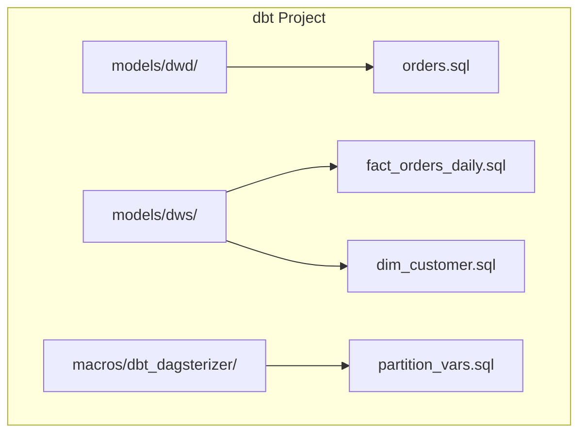

**Diagram sources**
- [orders.sql:1-22](file://src/dbt_dagsterizer/project_templates/luban-dagster-dbt-starrocks-code-location-source-template/{{cookiecutter.output_name}}/dbt_project/models/dwd/orders.sql#L1-L22)
- [fact_orders_daily.sql:1-19](file://src/dbt_dagsterizer/project_templates/luban-dagster-dbt-starrocks-code-location-source-template/{{cookiecutter.output_name}}/dbt_project/models/dws/fact_orders_daily.sql#L1-L19)
- [dim_customer.sql:1-21](file://src/dbt_dagsterizer/project_templates/luban-dagster-dbt-starrocks-code-location-source-template/{{cookiecutter.output_name}}/dbt_project/models/dws/dim_customer.sql#L1-L21)
- [partition_vars.sql:1-19](file://src/dbt_dagsterizer/project_templates/luban-dagster-dbt-starrocks-code-location-source-template/{{cookiecutter.output_name}}/dbt_project/macros/dbt_dagsterizer/partition_vars.sql#L1-L19)

**Section sources**
- [dbt-models.md:9-31](file://docs/concepts/dbt-models.md#L9-L31)

## Core Components
- Layered Architecture: DWD for detail-level, time-partitioned, Primary Key tables; DWS for facts and dimensions with appropriate partitioning and incremental strategies.
- Partition Execution: Dagster passes partition windows (date/datetime) and dynamic partition keys to dbt via variables, enforced by custom macros.
- Incremental Logic: Partition window filtering for time-partitioned models and watermark-based incremental for dimensions.
- Automation and Observability: Dagster automation conditions, partition propagation, and run result telemetry.

**Section sources**
- [dbt-models.md:33-303](file://docs/concepts/dbt-models.md#L33-L303)

## Architecture Overview
The end-to-end flow connects Dagster orchestration with dbt model execution and StarRocks materialization:

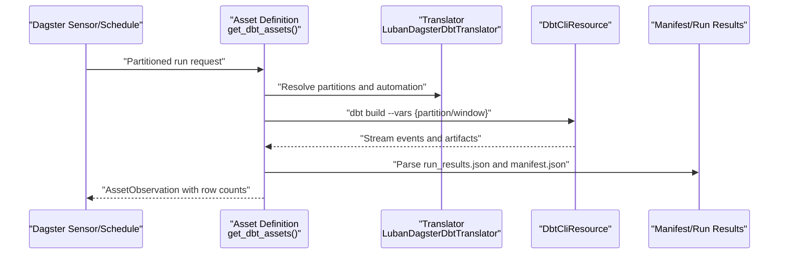

**Diagram sources**
- [assets.py:150-242](file://src/dbt_dagsterizer/assets/dbt/assets.py#L150-L242)
- [translator.py:44-140](file://src/dbt_dagsterizer/assets/dbt/translator.py#L44-L140)
- [run_results.py:75-144](file://src/dbt_dagsterizer/dbt/run_results.py#L75-L144)

## Detailed Component Analysis

### DWD Detail Models (Primary Key, Incremental)
DWD models clean and standardize source data into StarRocks Primary Key tables with datetime partitioning and incremental processing.

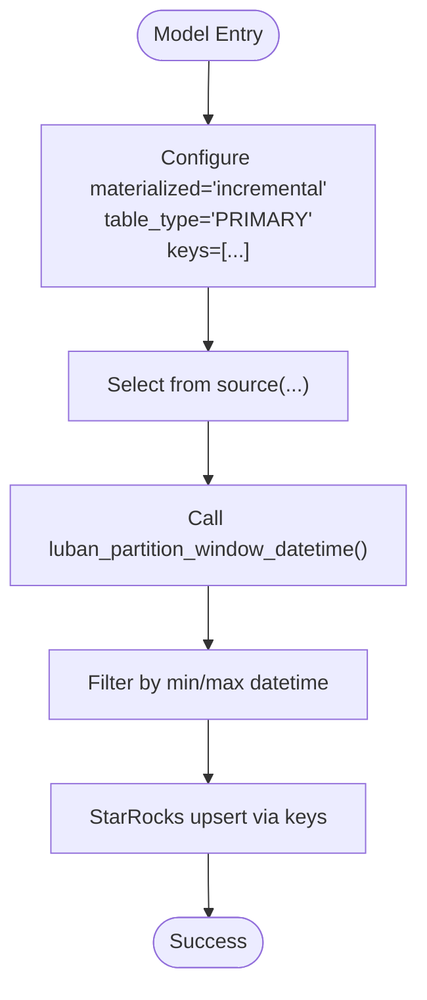

**Diagram sources**
- [orders.sql:1-22](file://src/dbt_dagsterizer/project_templates/luban-dagster-dbt-starrocks-code-location-source-template/{{cookiecutter.output_name}}/dbt_project/models/dwd/orders.sql#L1-L22)
- [partition_vars.sql:11-18](file://src/dbt_dagsterizer/project_templates/luban-dagster-dbt-starrocks-code-location-source-template/{{cookiecutter.output_name}}/dbt_project/macros/dbt_dagsterizer/partition_vars.sql#L11-L18)

**Section sources**
- [dbt-models.md:35-78](file://docs/concepts/dbt-models.md#L35-L78)
- [orders.sql:1-22](file://src/dbt_dagsterizer/project_templates/luban-dagster-dbt-starrocks-code-location-source-template/{{cookiecutter.output_name}}/dbt_project/models/dwd/orders.sql#L1-L22)

### DWS Fact Models (Daily Partitioned)
DWS fact models aggregate DWD outputs into daily partitions using unique_key for incremental upserts.

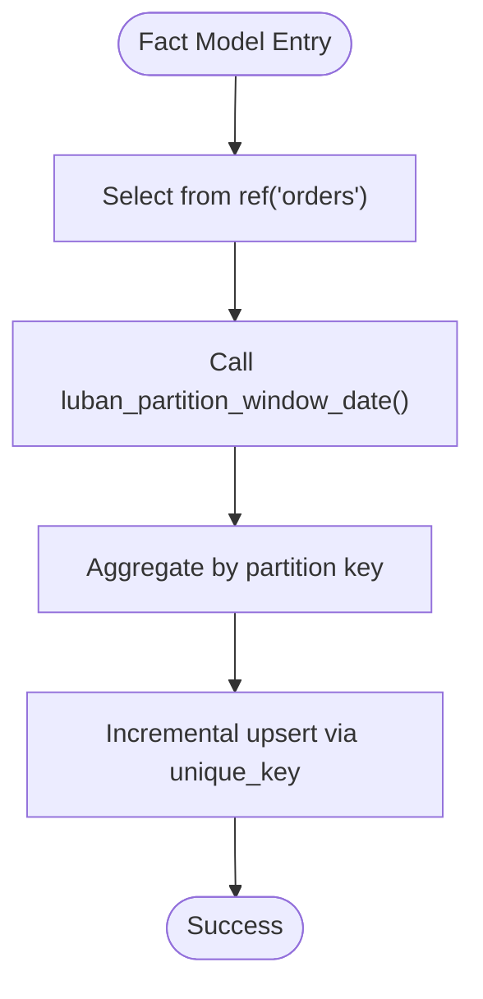

**Diagram sources**
- [fact_orders_daily.sql:1-19](file://src/dbt_dagsterizer/project_templates/luban-dagster-dbt-starrocks-code-location-source-template/{{cookiecutter.output_name}}/dbt_project/models/dws/fact_orders_daily.sql#L1-L19)
- [partition_vars.sql:1-8](file://src/dbt_dagsterizer/project_templates/luban-dagster-dbt-starrocks-code-location-source-template/{{cookiecutter.output_name}}/dbt_project/macros/dbt_dagsterizer/partition_vars.sql#L1-L8)

**Section sources**
- [dbt-models.md:79-116](file://docs/concepts/dbt-models.md#L79-L116)
- [fact_orders_daily.sql:1-19](file://src/dbt_dagsterizer/project_templates/luban-dagster-dbt-starrocks-code-location-source-template/{{cookiecutter.output_name}}/dbt_project/models/dws/fact_orders_daily.sql#L1-L19)

### DWS Dimension Models (Event-Driven Watermarks)
DWS dimension models refresh when upstream data changes using watermark comparisons.

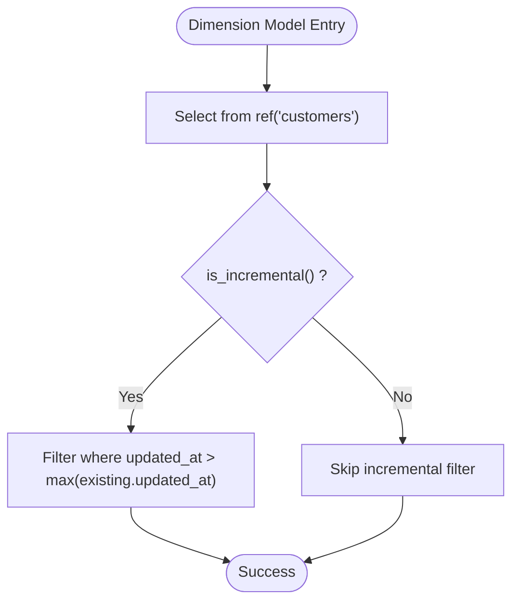

**Diagram sources**
- [dim_customer.sql:1-21](file://src/dbt_dagsterizer/project_templates/luban-dagster-dbt-starrocks-code-location-source-template/{{cookiecutter.output_name}}/dbt_project/models/dws/dim_customer.sql#L1-L21)

**Section sources**
- [dbt-models.md:118-151](file://docs/concepts/dbt-models.md#L118-L151)
- [dim_customer.sql:1-21](file://src/dbt_dagsterizer/project_templates/luban-dagster-dbt-starrocks-code-location-source-template/{{cookiecutter.output_name}}/dbt_project/models/dws/dim_customer.sql#L1-L21)

### Dynamic Partition Models (Business Keys)
Dynamic partitions split work by business keys (e.g., country_code, tenant_id) while optionally combining with time windows.

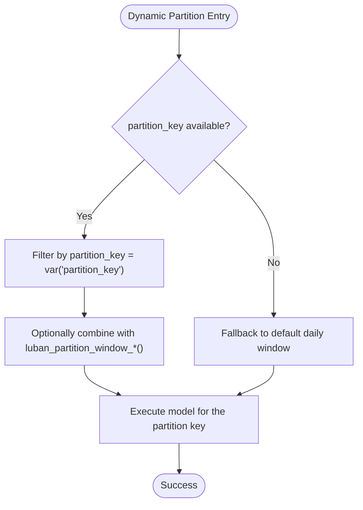

**Diagram sources**
- [dbt-models.md:152-244](file://docs/concepts/dbt-models.md#L152-L244)

**Section sources**
- [dbt-models.md:152-244](file://docs/concepts/dbt-models.md#L152-L244)

### Partition Window Macros and Variable Injection
Dagster injects partition variables into dbt runs; macros validate and return partition windows.

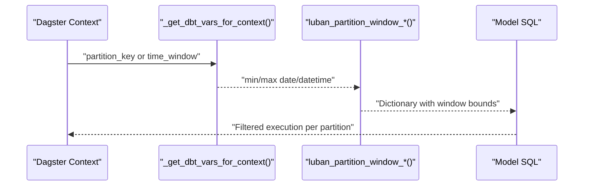

**Diagram sources**
- [vars.py:25-61](file://src/dbt_dagsterizer/assets/dbt/vars.py#L25-L61)
- [partition_vars.sql:1-19](file://src/dbt_dagsterizer/project_templates/luban-dagster-dbt-starrocks-code-location-source-template/{{cookiecutter.output_name}}/dbt_project/macros/dbt_dagsterizer/partition_vars.sql#L1-L19)

**Section sources**
- [dbt-models.md:305-375](file://docs/concepts/dbt-models.md#L305-L375)
- [vars.py:25-61](file://src/dbt_dagsterizer/assets/dbt/vars.py#L25-L61)

### Asset Definition and Row Count Telemetry
The dbt asset definition orchestrates dbt CLI execution, captures run results, and emits row count observations with partition context.

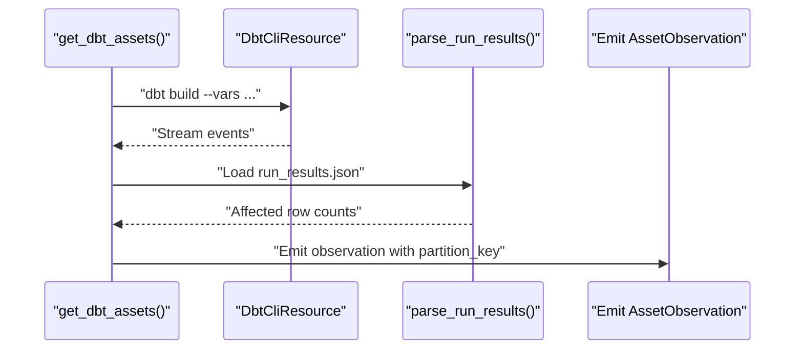

**Diagram sources**
- [assets.py:150-242](file://src/dbt_dagsterizer/assets/dbt/assets.py#L150-L242)
- [run_results.py:75-144](file://src/dbt_dagsterizer/dbt/run_results.py#L75-L144)

**Section sources**
- [assets.py:150-242](file://src/dbt_dagsterizer/assets/dbt/assets.py#L150-L242)
- [run_results.py:214-227](file://src/dbt_dagsterizer/dbt/run_results.py#L214-L227)

### Translator and Automation Conditions
The translator maps dbt resources to Dagster assets, applies partition definitions, and sets automation conditions based on tags and layers.

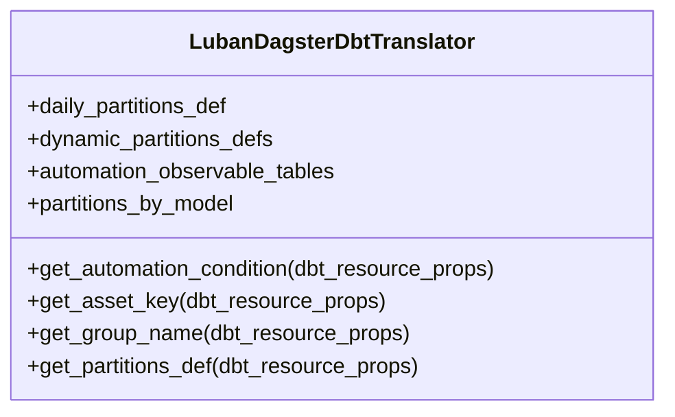

**Diagram sources**
- [translator.py:44-140](file://src/dbt_dagsterizer/assets/dbt/translator.py#L44-L140)

**Section sources**
- [translator.py:44-140](file://src/dbt_dagsterizer/assets/dbt/translator.py#L44-L140)

### Manifest Loading and Model Indexing
Manifest preparation ensures dbt artifacts are present and indexed for automation and telemetry.

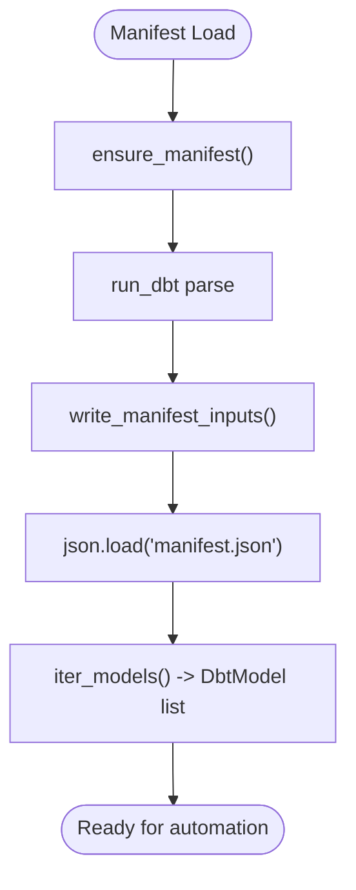

**Diagram sources**
- [manifest_prepare.py:57-72](file://src/dbt_dagsterizer/dbt/manifest_prepare.py#L57-L72)
- [manifest.py:28-64](file://src/dbt_dagsterizer/dbt/manifest.py#L28-L64)

**Section sources**
- [manifest_prepare.py:57-72](file://src/dbt_dagsterizer/dbt/manifest_prepare.py#L57-L72)
- [manifest.py:28-64](file://src/dbt_dagsterizer/dbt/manifest.py#L28-L64)

## Dependency Analysis
The dbt models concept integrates with Dagster through a clear dependency chain: orchestration configuration defines partitions and automation; the translator resolves assets and partitions; the asset definition executes dbt builds with injected variables; run results feed telemetry and row count observations.

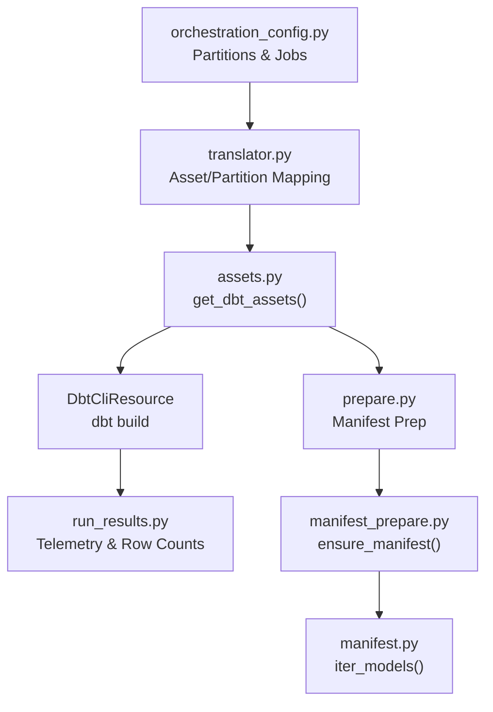

**Diagram sources**
- [orchestration_config.py:120-191](file://src/dbt_dagsterizer/orchestration_config.py#L120-L191)
- [translator.py:44-140](file://src/dbt_dagsterizer/assets/dbt/translator.py#L44-L140)
- [assets.py:150-242](file://src/dbt_dagsterizer/assets/dbt/assets.py#L150-L242)
- [prepare.py:9-18](file://src/dbt_dagsterizer/assets/dbt/prepare.py#L9-L18)
- [manifest_prepare.py:57-72](file://src/dbt_dagsterizer/dbt/manifest_prepare.py#L57-L72)
- [manifest.py:40-64](file://src/dbt_dagsterizer/dbt/manifest.py#L40-L64)
- [run_results.py:258-370](file://src/dbt_dagsterizer/dbt/run_results.py#L258-L370)

**Section sources**
- [orchestration_config.py:120-191](file://src/dbt_dagsterizer/orchestration_config.py#L120-L191)
- [assets.py:150-242](file://src/dbt_dagsterizer/assets/dbt/assets.py#L150-L242)

## Performance Considerations
- Prefer incremental materialization for large tables to avoid full rebuilds.
- Use Primary Key tables in StarRocks for efficient upserts and partition pruning.
- Apply partition window filtering consistently to limit scanned data per run.
- Tag dimensions for eager automation to reduce latency in downstream recomputation.
- Leverage run result telemetry to monitor long-running nodes and optimize execution.

[No sources needed since this section provides general guidance]

## Troubleshooting Guide
Common issues and resolutions:
- Missing partition variables: Ensure runs are executed via Dagster or pass partition variables explicitly.
- Dynamic partition key undefined: Provide the partition_key variable or run via Dagster’s partitioned execution.
- Incremental not working: Verify materialized='incremental', unique_key or keys, and is_incremental() checks.
- Model processes all data: Confirm luban_partition_window_*() macro usage and where clause application.

**Section sources**
- [dbt-models.md:658-724](file://docs/concepts/dbt-models.md#L658-L724)
- [vars.py:25-61](file://src/dbt_dagsterizer/assets/dbt/vars.py#L25-L61)

## Conclusion
Dbt models in this project follow a disciplined layered architecture optimized for StarRocks and Dagster orchestration. By adopting partition window macros, incremental strategies, and automation conditions, teams can achieve reliable, observable, and scalable data transformations. The provided patterns and integrations enable consistent execution across time-partitioned and dynamic partition scenarios while maintaining strong observability through run result telemetry.