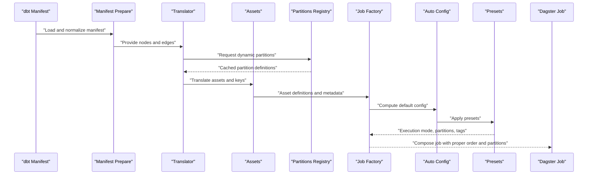
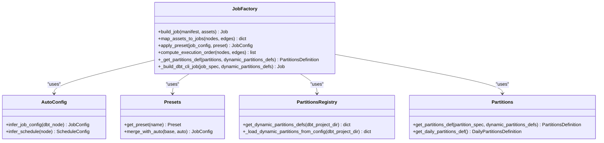
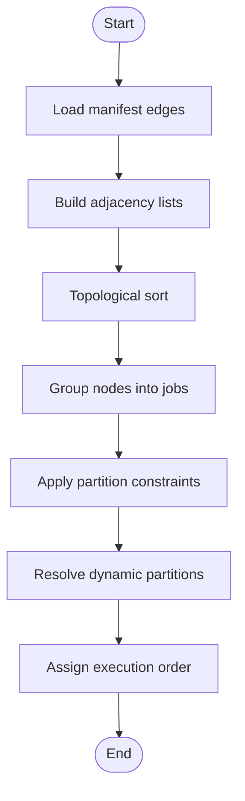
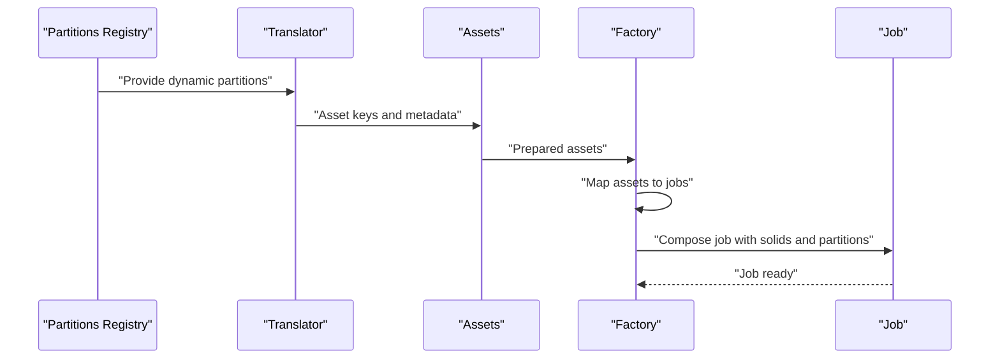
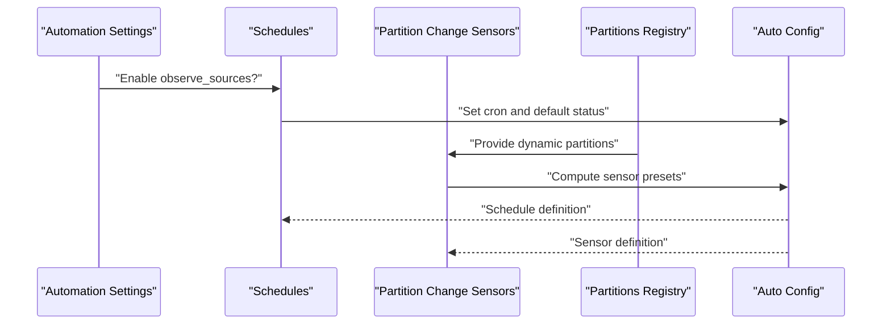
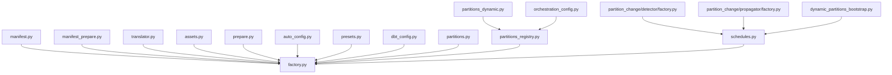

# Automatic Job Creation

<cite>
**Referenced Files in This Document**
- [jobs.py](file://src/dbt_dagsterizer/jobs/dbt/jobs.py)
- [factory.py](file://src/dbt_dagsterizer/jobs/dbt/factory.py)
- [auto_config.py](file://src/dbt_dagsterizer/jobs/dbt/auto_config.py)
- [presets.py](file://src/dbt_dagsterizer/jobs/dbt/presets.py)
- [dbt_config.py](file://src/dbt_dagsterizer/jobs/dbt_config.py)
- [manifest.py](file://src/dbt_dagsterizer/dbt/manifest.py)
- [manifest_prepare.py](file://src/dbt_dagsterizer/dbt/manifest_prepare.py)
- [assets.py](file://src/dbt_dagsterizer/assets/dbt/assets.py)
- [translator.py](file://src/dbt_dagsterizer/assets/dbt/translator.py)
- [prepare.py](file://src/dbt_dagsterizer/assets/dbt/prepare.py)
- [automation.py](file://src/dbt_dagsterizer/assets/sources/automation.py)
- [schedules.py](file://src/dbt_dagsterizer/schedules/sources/schedules.py)
- [partition_change/detector/factory.py](file://src/dbt_dagsterizer/sensors/partition_change/detector/factory.py)
- [partition_change/detector/dbt_manifest.py](file://src/dbt_dagsterizer/sensors/partition_change/detector/dbt_manifest.py)
- [partition_change/detector/presets.py](file://src/dbt_dagsterizer/sensors/partition_change/detector/presets.py)
- [partition_change/propagator/factory.py](file://src/dbt_dagsterizer/sensors/partition_change/propagator/factory.py)
- [partition_change/propagator/presets.py](file://src/dbt_dagsterizer/sensors/partition_change/propagator/presets.py)
- [auto_config.py](file://src/dbt_dagsterizer/sensors/partition_change/auto_config.py)
- [partitions.py](file://src/dbt_dagsterizer/partitions.py)
- [partitions_dynamic.py](file://src/dbt_dagsterizer/partitions_dynamic.py)
- [partitions_registry.py](file://src/dbt_dagsterizer/partitions_registry.py)
- [orchestration_config.py](file://src/dbt_dagsterizer/orchestration_config.py)
- [dynamic_partitions_bootstrap.py](file://src/dbt_dagsterizer/sensors/dynamic_partitions_bootstrap.py)
- [test_dynamic_partitions.py](file://tests/test_dynamic_partitions.py)
- [dagsterization.yml](file://src/dbt_dagsterizer/project_templates/luban-dagster-dbt-starrocks-code-location-source-template/{{cookiecutter.output_name}}/dbt_project/dagsterization.yml)
</cite>

## Update Summary
**Changes Made**
- Enhanced Job Factory to support dynamic partition definitions with comprehensive caching system
- Added new partitions_dynamic.py module for dynamic partition management and caching
- Added new partitions_registry.py module for centralized dynamic partition initialization
- Added new dynamic_partitions_bootstrap.py sensor for automatic dynamic partition synchronization
- Enhanced orchestration_config.py with DynamicPartitionConfig schema and dynamic partition management APIs
- Integrated dynamic partitions into asset translation, job composition, and sensor detection
- Added comprehensive test coverage for dynamic partition functionality including caching, validation, and bootstrapping

## Table of Contents
1. [Introduction](#introduction)
2. [Project Structure](#project-structure)
3. [Core Components](#core-components)
4. [Architecture Overview](#architecture-overview)
5. [Detailed Component Analysis](#detailed-component-analysis)
6. [Dynamic Partition Support](#dynamic-partition-support)
7. [Dependency Analysis](#dependency-analysis)
8. [Performance Considerations](#performance-considerations)
9. [Troubleshooting Guide](#troubleshooting-guide)
10. [Conclusion](#conclusion)
11. [Appendices](#appendices)

## Introduction
This document explains how dbt-dagsterizer automatically creates Dagster jobs from dbt model dependencies and manifest data. It covers the dependency graph analysis process, job composition algorithms, automatic scheduling inference, and the factory pattern used to generate jobs. The system now includes comprehensive support for dynamic partitions, allowing flexible partitioning beyond traditional time-based or unpartitioned models. It also documents configuration options for automatic behavior, naming conventions, and metadata assignment, with examples drawn from different dbt model types and dependency scenarios.

## Project Structure
The automatic job creation capability spans several modules with enhanced dynamic partition support:
- Jobs: automatic job generation and configuration for dbt assets with dynamic partition support
- Schedules: automatic schedule inference for dbt jobs and observable sources with dynamic partition awareness
- Sensors: partition change detection and propagation, including dynamic partition key management
- Assets: dbt asset translation with dynamic partition resolution
- DBT Manifest: parsing and preparing dbt manifest data for job/schedule inference
- Partitions: core partitioning system with dynamic partition support
- Partitions Registry: centralized dynamic partition initialization and caching
- Orchestration Config: configuration schema supporting dynamic partition definitions
- Templates: project-level configuration for dagsterization behavior

```mermaid
graph TB
subgraph "Jobs"
JF["factory.py"]
JA["auto_config.py"]
JP["presets.py"]
JC["dbt_config.py"]
JJ["jobs.py"]
end
subgraph "Schedules"
SC["auto_config.py"]
SF["factory.py"]
SS["schedules.py"]
end
subgraph "Sensors"
PCD["partition_change/detector/factory.py"]
PCDM["partition_change/detector/dbt_manifest.py"]
PCP["partition_change/detector/presets.py"]
PCPF["partition_change/propagator/factory.py"]
PCPP["partition_change/propagator/presets.py"]
PCA["auto_config.py"]
DPBS["dynamic_partitions_bootstrap.py"]
end
subgraph "Assets"
AD["assets.py"]
AT["translator.py"]
AP["prepare.py"]
end
subgraph "Partitions"
P["partitions.py"]
PD["partitions_dynamic.py"]
PR["partitions_registry.py"]
OC["orchestration_config.py"]
end
subgraph "DBT Manifest"
DM["manifest.py"]
DMP["manifest_prepare.py"]
end
subgraph "Templates"
TPL["dagsterization.yml"]
end
DM --> JF
DMP --> JF
AT --> JF
AD --> JF
AP --> JF
P --> JF
PD --> PR
PR --> JF
OC --> PR
JF --> JJ
JA --> JJ
JP --> JJ
JC --> JJ
SC --> SS
SF --> SS
SS --> JJ
PCD --> SS
PCDM --> SS
PCP --> SS
PCPF --> SS
PCPP --> SS
PCA --> SS
DPBS --> SS
TPL --> JC
```



**Diagram sources**
- [jobs.py](file://src/dbt_dagsterizer/jobs/dbt/jobs.py)
- [factory.py](file://src/dbt_dagsterizer/jobs/dbt/factory.py)
- [auto_config.py](file://src/dbt_dagsterizer/jobs/dbt/auto_config.py)
- [presets.py](file://src/dbt_dagsterizer/jobs/dbt/presets.py)
- [dbt_config.py](file://src/dbt_dagsterizer/jobs/dbt_config.py)
- [manifest.py](file://src/dbt_dagsterizer/dbt/manifest.py)
- [manifest_prepare.py](file://src/dbt_dagsterizer/dbt/manifest_prepare.py)
- [assets.py](file://src/dbt_dagsterizer/assets/dbt/assets.py)
- [translator.py](file://src/dbt_dagsterizer/assets/dbt/translator.py)
- [prepare.py](file://src/dbt_dagsterizer/assets/dbt/prepare.py)
- [schedules.py](file://src/dbt_dagsterizer/schedules/sources/schedules.py)
- [partition_change/detector/factory.py](file://src/dbt_dagsterizer/sensors/partition_change/detector/factory.py)
- [partition_change/detector/dbt_manifest.py](file://src/dbt_dagsterizer/sensors/partition_change/detector/dbt_manifest.py)
- [partition_change/detector/presets.py](file://src/dbt_dagsterizer/sensors/partition_change/detector/presets.py)
- [partition_change/propagator/factory.py](file://src/dbt_dagsterizer/sensors/partition_change/propagator/factory.py)
- [partition_change/propagator/presets.py](file://src/dbt_dagsterizer/sensors/partition_change/propagator/presets.py)
- [auto_config.py](file://src/dbt_dagsterizer/sensors/partition_change/auto_config.py)
- [partitions.py](file://src/dbt_dagsterizer/partitions.py)
- [partitions_dynamic.py](file://src/dbt_dagsterizer/partitions_dynamic.py)
- [partitions_registry.py](file://src/dbt_dagsterizer/partitions_registry.py)
- [orchestration_config.py](file://src/dbt_dagsterizer/orchestration_config.py)
- [dynamic_partitions_bootstrap.py](file://src/dbt_dagsterizer/sensors/dynamic_partitions_bootstrap.py)
- [dagsterization.yml](file://src/dbt_dagsterizer/project_templates/luban-dagster-dbt-starrocks-code-location-source-template/{{cookiecutter.output_name}}/dbt_project/dagsterization.yml)

**Section sources**
- [jobs.py](file://src/dbt_dagsterizer/jobs/dbt/jobs.py)
- [factory.py](file://src/dbt_dagsterizer/jobs/dbt/factory.py)
- [auto_config.py](file://src/dbt_dagsterizer/jobs/dbt/auto_config.py)
- [presets.py](file://src/dbt_dagsterizer/jobs/dbt/presets.py)
- [dbt_config.py](file://src/dbt_dagsterizer/jobs/dbt_config.py)
- [manifest.py](file://src/dbt_dagsterizer/dbt/manifest.py)
- [manifest_prepare.py](file://src/dbt_dagsterizer/dbt/manifest_prepare.py)
- [assets.py](file://src/dbt_dagsterizer/assets/dbt/assets.py)
- [translator.py](file://src/dbt_dagsterizer/assets/dbt/translator.py)
- [prepare.py](file://src/dbt_dagsterizer/assets/dbt/prepare.py)
- [schedules.py](file://src/dbt_dagsterizer/schedules/sources/schedules.py)
- [partition_change/detector/factory.py](file://src/dbt_dagsterizer/sensors/partition_change/detector/factory.py)
- [partition_change/detector/dbt_manifest.py](file://src/dbt_dagsterizer/sensors/partition_change/detector/dbt_manifest.py)
- [partition_change/detector/presets.py](file://src/dbt_dagsterizer/sensors/partition_change/detector/presets.py)
- [partition_change/propagator/factory.py](file://src/dbt_dagsterizer/sensors/partition_change/propagator/factory.py)
- [partition_change/propagator/presets.py](file://src/dbt_dagsterizer/sensors/partition_change/propagator/presets.py)
- [auto_config.py](file://src/dbt_dagsterizer/sensors/partition_change/auto_config.py)
- [partitions.py](file://src/dbt_dagsterizer/partitions.py)
- [partitions_dynamic.py](file://src/dbt_dagsterizer/partitions_dynamic.py)
- [partitions_registry.py](file://src/dbt_dagsterizer/partitions_registry.py)
- [orchestration_config.py](file://src/dbt_dagsterizer/orchestration_config.py)
- [dynamic_partitions_bootstrap.py](file://src/dbt_dagsterizer/sensors/dynamic_partitions_bootstrap.py)
- [dagsterization.yml](file://src/dbt_dagsterizer/project_templates/luban-dagster-dbt-starrocks-code-location-source-template/{{cookiecutter.output_name}}/dbt_project/dagsterization.yml)

## Core Components
- Job Factory: constructs Dagster jobs from dbt manifest data and asset definitions with dynamic partition support.
- Auto Config: computes default job and schedule configurations from dbt dependencies and project settings.
- Presets: provides named defaults for job modes, partitions, and execution policies.
- DBT Manifest Integration: parses and prepares dbt manifest artifacts for job/sensor inference.
- Assets Pipeline: translates dbt assets into Dagster assets with dynamic partition resolution.
- Partitions System: core partitioning infrastructure supporting daily, dynamic, and unpartitioned models.
- Partitions Registry: centralized initialization and caching of dynamic partition definitions.
- Orchestration Config: configuration schema supporting dynamic partition definitions and model partition assignments.
- Schedules: infers schedules for dbt jobs and observable sources based on automation settings.
- Sensors: detects partition changes and propagates impact ranges to refine job execution windows.
- Dynamic Partitions Bootstrap: sensor for automatic synchronization of dynamic partition keys.

Key responsibilities:
- Dependency Graph Analysis: build topological ordering of dbt nodes to determine execution order.
- Asset-to-Job Mapping: map dbt assets to jobs while respecting upstream/downstream boundaries.
- Automatic Scheduling Inference: derive cron schedules and default statuses from dbt metadata and project presets.
- Dynamic Partition Resolution: resolve 'dynamic:name' partition specifications to actual partition definitions.
- Metadata Assignment: propagate dbt model properties and tags into Dagster job and asset metadata.

**Section sources**
- [factory.py](file://src/dbt_dagsterizer/jobs/dbt/factory.py)
- [auto_config.py](file://src/dbt_dagsterizer/jobs/dbt/auto_config.py)
- [presets.py](file://src/dbt_dagsterizer/jobs/dbt/presets.py)
- [manifest.py](file://src/dbt_dagsterizer/dbt/manifest.py)
- [manifest_prepare.py](file://src/dbt_dagsterizer/dbt/manifest_prepare.py)
- [assets.py](file://src/dbt_dagsterizer/assets/dbt/assets.py)
- [translator.py](file://src/dbt_dagsterizer/assets/dbt/translator.py)
- [prepare.py](file://src/dbt_dagsterizer/assets/dbt/prepare.py)
- [partitions.py](file://src/dbt_dagsterizer/partitions.py)
- [partitions_dynamic.py](file://src/dbt_dagsterizer/partitions_dynamic.py)
- [partitions_registry.py](file://src/dbt_dagsterizer/partitions_registry.py)
- [orchestration_config.py](file://src/dbt_dagsterizer/orchestration_config.py)
- [schedules.py](file://src/dbt_dagsterizer/schedules/sources/schedules.py)
- [partition_change/detector/factory.py](file://src/dbt_dagsterizer/sensors/partition_change/detector/factory.py)
- [partition_change/propagator/factory.py](file://src/dbt_dagsterizer/sensors/partition_change/propagator/factory.py)
- [dynamic_partitions_bootstrap.py](file://src/dbt_dagsterizer/sensors/dynamic_partitions_bootstrap.py)

## Architecture Overview
The automatic job creation pipeline integrates dbt manifest data, asset translation, and preset-driven configuration to produce Dagster jobs and schedules with comprehensive partition support including dynamic partitions.



**Diagram sources**
- [manifest.py](file://src/dbt_dagsterizer/dbt/manifest.py)
- [manifest_prepare.py](file://src/dbt_dagsterizer/dbt/manifest_prepare.py)
- [translator.py](file://src/dbt_dagsterizer/assets/dbt/translator.py)
- [assets.py](file://src/dbt_dagsterizer/assets/dbt/assets.py)
- [partitions_registry.py](file://src/dbt_dagsterizer/partitions_registry.py)
- [factory.py](file://src/dbt_dagsterizer/jobs/dbt/factory.py)
- [auto_config.py](file://src/dbt_dagsterizer/jobs/dbt/auto_config.py)
- [presets.py](file://src/dbt_dagsterizer/jobs/dbt/presets.py)

## Detailed Component Analysis

### Job Factory Pattern
The job factory builds Dagster jobs from dbt assets and manifest data with enhanced dynamic partition support. It orchestrates:
- Topological sorting of dbt nodes to define execution order
- Asset-to-job mapping respecting upstream/downstream boundaries
- Dynamic partition resolution for 'dynamic:name' partition specifications
- Metadata propagation from dbt to Dagster (tags, owners, descriptions)
- Partition and schedule configuration via presets and automation settings



**Diagram sources**
- [factory.py](file://src/dbt_dagsterizer/jobs/dbt/factory.py)
- [auto_config.py](file://src/dbt_dagsterizer/jobs/dbt/auto_config.py)
- [presets.py](file://src/dbt_dagsterizer/jobs/dbt/presets.py)
- [partitions_registry.py](file://src/dbt_dagsterizer/partitions_registry.py)
- [partitions.py](file://src/dbt_dagsterizer/partitions.py)

**Section sources**
- [factory.py](file://src/dbt_dagsterizer/jobs/dbt/factory.py)
- [auto_config.py](file://src/dbt_dagsterizer/jobs/dbt/auto_config.py)
- [presets.py](file://src/dbt_dagsterizer/jobs/dbt/presets.py)
- [partitions_registry.py](file://src/dbt_dagsterizer/partitions_registry.py)
- [partitions.py](file://src/dbt_dagsterizer/partitions.py)

### Dependency Graph Analysis and Execution Order
The factory analyzes dbt manifest edges to construct a dependency graph and compute execution order:
- Build adjacency lists from manifest edges
- Perform topological sort to determine node execution order
- Group nodes into job units respecting asset boundaries and partition constraints
- Assign downstream tasks to run after upstream completion
- Resolve dynamic partitions for jobs requiring partition-aware execution



**Diagram sources**
- [factory.py](file://src/dbt_dagsterizer/jobs/dbt/factory.py)
- [manifest_prepare.py](file://src/dbt_dagsterizer/dbt/manifest_prepare.py)
- [partitions.py](file://src/dbt_dagsterizer/partitions.py)

**Section sources**
- [factory.py](file://src/dbt_dagsterizer/jobs/dbt/factory.py)
- [manifest_prepare.py](file://src/dbt_dagsterizer/dbt/manifest_prepare.py)
- [partitions.py](file://src/dbt_dagsterizer/partitions.py)

### Asset-to-Job Mapping and Composition
The factory maps dbt assets to jobs by:
- Translating dbt relations to Dagster asset keys
- Using translator utilities to resolve naming and grouping
- Resolving dynamic partitions for models with 'dynamic:name' partition specifications
- Preparing assets with metadata and partition definitions
- Composing job solids in execution order and attaching schedules



**Diagram sources**
- [partitions_registry.py](file://src/dbt_dagsterizer/partitions_registry.py)
- [translator.py](file://src/dbt_dagsterizer/assets/dbt/translator.py)
- [assets.py](file://src/dbt_dagsterizer/assets/dbt/assets.py)
- [factory.py](file://src/dbt_dagsterizer/jobs/dbt/factory.py)

**Section sources**
- [translator.py](file://src/dbt_dagsterizer/assets/dbt/translator.py)
- [assets.py](file://src/dbt_dagsterizer/assets/dbt/assets.py)
- [factory.py](file://src/dbt_dagsterizer/jobs/dbt/factory.py)
- [partitions_registry.py](file://src/dbt_dagsterizer/partitions_registry.py)

### Automatic Scheduling Inference
Schedules are inferred from dbt automation settings and project presets:
- Observable sources schedule: checks automation flag and sets cron and default status
- Partition change sensors: detect partition updates and propagate impact ranges
- Sensor factories: build sensor definitions aligned with dbt manifest and presets
- Dynamic partition awareness: sensors can handle dynamic partition key changes



**Diagram sources**
- [schedules.py](file://src/dbt_dagsterizer/schedules/sources/schedules.py)
- [auto_config.py](file://src/dbt_dagsterizer/sensors/partition_change/auto_config.py)
- [partition_change/detector/factory.py](file://src/dbt_dagsterizer/sensors/partition_change/detector/factory.py)
- [partition_change/propagator/factory.py](file://src/dbt_dagsterizer/sensors/partition_change/propagator/factory.py)
- [partitions_registry.py](file://src/dbt_dagsterizer/partitions_registry.py)

**Section sources**
- [schedules.py](file://src/dbt_dagsterizer/schedules/sources/schedules.py)
- [auto_config.py](file://src/dbt_dagsterizer/sensors/partition_change/auto_config.py)
- [partition_change/detector/factory.py](file://src/dbt_dagsterizer/sensors/partition_change/detector/factory.py)
- [partition_change/propagator/factory.py](file://src/dbt_dagsterizer/sensors/partition_change/propagator/factory.py)
- [partitions_registry.py](file://src/dbt_dagsterizer/partitions_registry.py)

### Configuration Options and Naming Conventions
Configuration is driven by:
- Project-level presets and automation flags
- DBT manifest metadata (model owners, tags, materializations)
- Template-defined defaults in dagsterization.yml
- Environment variables for schedule tuning
- Dynamic partition definitions in orchestration configuration

Examples of configurable aspects:
- Job naming conventions derived from dbt model names and groups
- Partition definitions mapped from dbt models to Dagster partitions (daily, dynamic, unpartitioned)
- Dynamic partition definitions with initial keys and model assignments
- Cron schedule presets applied per model type or group
- Default status for schedules controlled by automation flags

**Section sources**
- [presets.py](file://src/dbt_dagsterizer/jobs/dbt/presets.py)
- [dbt_config.py](file://src/dbt_dagsterizer/jobs/dbt_config.py)
- [orchestration_config.py](file://src/dbt_dagsterizer/orchestration_config.py)
- [dagsterization.yml](file://src/dbt_dagsterizer/project_templates/luban-dagster-dbt-starrocks-code-location-source-template/{{cookiecutter.output_name}}/dbt_project/dagsterization.yml)

### Examples of Automatic Job Generation

#### Example 1: Incremental Model with Partitioned Upstream
- Scenario: An incremental dbt model depends on a partitioned upstream model.
- Behavior: The factory groups nodes into a single job respecting partition boundaries, assigns execution order via topological sort, and applies partition presets for downstream runs.

#### Example 2: Star Schema with Fact/Dimension Separation
- Scenario: A fact table depends on multiple dimension tables.
- Behavior: The factory composes a job that executes dimension tables first, followed by the fact table, ensuring data consistency.

#### Example 3: Dynamic Partition Model
- Scenario: A model with 'dynamic:region' partition specification depends on dimension tables.
- Behavior: The factory resolves the dynamic partition definition from the registry, creates a job with dynamic partition support, and ensures proper execution order with upstream dependencies.

#### Example 4: Observability Workflow
- Scenario: Observable sources are enabled via automation.
- Behavior: A schedule is created with a default status set to running and a cron interval configured from environment variables.

**Section sources**
- [factory.py](file://src/dbt_dagsterizer/jobs/dbt/factory.py)
- [schedules.py](file://src/dbt_dagsterizer/schedules/sources/schedules.py)
- [partition_change/detector/factory.py](file://src/dbt_dagsterizer/sensors/partition_change/detector/factory.py)
- [partition_change/propagator/factory.py](file://src/dbt_dagsterizer/sensors/partition_change/propagator/factory.py)
- [partitions_registry.py](file://src/dbt_dagsterizer/partitions_registry.py)

## Dynamic Partition Support

### Dynamic Partition Architecture
The system now supports dynamic partitions through a comprehensive architecture that enables flexible partitioning beyond traditional time-based or unpartitioned models.

```mermaid
graph TB
subgraph "Dynamic Partition System"
DP["Dynamic Partitions Definition"]
PD["Partitions Dynamic Cache"]
PR["Partitions Registry"]
OC["Orchestration Config"]
DPBS["Dynamic Partitions Bootstrap Sensor"]
end
subgraph "Integration Points"
JF["Job Factory"]
AT["Asset Translator"]
SC["Schedules"]
PS["Partition Sensors"]
AS["Assets"]
END
DP --> PD
PD --> PR
PR --> JF
PR --> AT
PR --> SC
PR --> PS
PR --> AS
OC --> PR
DPBS --> PR
JF --> DP
AT --> DP
SC --> DP
PS --> DP
AS --> DP
```

**Diagram sources**
- [partitions_dynamic.py](file://src/dbt_dagsterizer/partitions_dynamic.py)
- [partitions_registry.py](file://src/dbt_dagsterizer/partitions_registry.py)
- [orchestration_config.py](file://src/dbt_dagsterizer/orchestration_config.py)
- [dynamic_partitions_bootstrap.py](file://src/dbt_dagsterizer/sensors/dynamic_partitions_bootstrap.py)
- [factory.py](file://src/dbt_dagsterizer/jobs/dbt/factory.py)
- [translator.py](file://src/dbt_dagsterizer/assets/dbt/translator.py)
- [assets.py](file://src/dbt_dagsterizer/assets/dbt/assets.py)
- [schedules.py](file://src/dbt_dagsterizer/schedules/sources/schedules.py)

### Dynamic Partition Configuration
Dynamic partitions are configured through the orchestration configuration system with the following schema:

- **Name**: Unique identifier for the dynamic partition (e.g., "country_code")
- **Initial Partition Keys**: List of initial partition key values
- **Model Assignments**: Models assigned to specific dynamic partitions
- **Runtime Key Management**: Dynamic addition/removal of partition keys

### Partition Specification Resolution
The system supports three partition specification formats:
- **Daily**: "daily" - Time-based daily partitions
- **Unpartitioned**: "unpartitioned" or None - No partitioning
- **Dynamic**: "dynamic:name" - Dynamic partitions with the specified name

### Integration with Job Factory
The job factory has been enhanced to handle dynamic partitions seamlessly:

```mermaid
sequenceDiagram
participant CFG as "Orchestration Config"
participant REG as "Partitions Registry"
participant FAC as "Job Factory"
participant PAR as "Partitions"
participant JOB as "Dagster Job"
CFG->>REG : "Load dynamic partitions"
REG->>REG : "Initialize definitions"
REG-->>FAC : "Dynamic partitions dict"
FAC->>PAR : "Resolve 'dynamic : name' spec"
PAR->>REG : "Lookup partition definition"
REG-->>PAR : "Return cached definition"
PAR-->>FAC : "PartitionsDefinition"
FAC-->>JOB : "Create job with dynamic partitions"
```

**Diagram sources**
- [partitions_registry.py](file://src/dbt_dagsterizer/partitions_registry.py)
- [factory.py](file://src/dbt_dagsterizer/jobs/dbt/factory.py)
- [partitions.py](file://src/dbt_dagsterizer/partitions.py)

### Dynamic Partitions Bootstrap Sensor
A new sensor has been added to automatically synchronize dynamic partition keys between the orchestration configuration and the Dagster instance:

- **Purpose**: Ensures dynamic partition keys in the Dagster instance match the initial_partition_keys from dagsterization.yml
- **Functionality**: Adds missing keys from config and removes extra keys from the instance
- **Frequency**: Runs periodically with configurable minimum interval
- **Logging**: Provides detailed logging of synchronization actions

**Section sources**
- [partitions.py](file://src/dbt_dagsterizer/partitions.py)
- [partitions_dynamic.py](file://src/dbt_dagsterizer/partitions_dynamic.py)
- [partitions_registry.py](file://src/dbt_dagsterizer/partitions_registry.py)
- [orchestration_config.py](file://src/dbt_dagsterizer/orchestration_config.py)
- [factory.py](file://src/dbt_dagsterizer/jobs/dbt/factory.py)
- [translator.py](file://src/dbt_dagsterizer/assets/dbt/translator.py)
- [assets.py](file://src/dbt_dagsterizer/assets/dbt/assets.py)
- [dynamic_partitions_bootstrap.py](file://src/dbt_dagsterizer/sensors/dynamic_partitions_bootstrap.py)
- [test_dynamic_partitions.py](file://tests/test_dynamic_partitions.py)

## Dependency Analysis
The automatic job creation system exhibits cohesive coupling around manifest parsing, asset translation, preset-driven configuration, and dynamic partition management.



**Diagram sources**
- [manifest.py](file://src/dbt_dagsterizer/dbt/manifest.py)
- [manifest_prepare.py](file://src/dbt_dagsterizer/dbt/manifest_prepare.py)
- [translator.py](file://src/dbt_dagsterizer/assets/dbt/translator.py)
- [assets.py](file://src/dbt_dagsterizer/assets/dbt/assets.py)
- [prepare.py](file://src/dbt_dagsterizer/assets/dbt/prepare.py)
- [auto_config.py](file://src/dbt_dagsterizer/jobs/dbt/auto_config.py)
- [presets.py](file://src/dbt_dagsterizer/jobs/dbt/presets.py)
- [dbt_config.py](file://src/dbt_dagsterizer/jobs/dbt_config.py)
- [partitions.py](file://src/dbt_dagsterizer/partitions.py)
- [partitions_dynamic.py](file://src/dbt_dagsterizer/partitions_dynamic.py)
- [partitions_registry.py](file://src/dbt_dagsterizer/partitions_registry.py)
- [orchestration_config.py](file://src/dbt_dagsterizer/orchestration_config.py)
- [schedules.py](file://src/dbt_dagsterizer/schedules/sources/schedules.py)
- [partition_change/detector/factory.py](file://src/dbt_dagsterizer/sensors/partition_change/detector/factory.py)
- [partition_change/propagator/factory.py](file://src/dbt_dagsterizer/sensors/partition_change/propagator/factory.py)
- [dynamic_partitions_bootstrap.py](file://src/dbt_dagsterizer/sensors/dynamic_partitions_bootstrap.py)

**Section sources**
- [factory.py](file://src/dbt_dagsterizer/jobs/dbt/factory.py)
- [auto_config.py](file://src/dbt_dagsterizer/jobs/dbt/auto_config.py)
- [presets.py](file://src/dbt_dagsterizer/jobs/dbt/presets.py)
- [dbt_config.py](file://src/dbt_dagsterizer/jobs/dbt_config.py)
- [manifest.py](file://src/dbt_dagsterizer/dbt/manifest.py)
- [manifest_prepare.py](file://src/dbt_dagsterizer/dbt/manifest_prepare.py)
- [assets.py](file://src/dbt_dagsterizer/assets/dbt/assets.py)
- [translator.py](file://src/dbt_dagsterizer/assets/dbt/translator.py)
- [prepare.py](file://src/dbt_dagsterizer/assets/dbt/prepare.py)
- [schedules.py](file://src/dbt_dagsterizer/schedules/sources/schedules.py)
- [partition_change/detector/factory.py](file://src/dbt_dagsterizer/sensors/partition_change/detector/factory.py)
- [partition_change/propagator/factory.py](file://src/dbt_dagsterizer/sensors/partition_change/propagator/factory.py)
- [partitions.py](file://src/dbt_dagsterizer/partitions.py)
- [partitions_dynamic.py](file://src/dbt_dagsterizer/partitions_dynamic.py)
- [partitions_registry.py](file://src/dbt_dagsterizer/partitions_registry.py)
- [orchestration_config.py](file://src/dbt_dagsterizer/orchestration_config.py)
- [dynamic_partitions_bootstrap.py](file://src/dbt_dagsterizer/sensors/dynamic_partitions_bootstrap.py)

## Performance Considerations
- Prefer topological sorting over repeated dependency resolution to minimize overhead.
- Cache prepared manifest data and asset translations to avoid recomputation across runs.
- Use partition-aware scheduling to constrain execution windows and reduce redundant runs.
- Leverage dynamic partition caching to avoid repeated initialization costs.
- Centralize dynamic partition initialization through the registry to ensure consistency across components.
- Use the dynamic partitions bootstrap sensor to maintain synchronization without manual intervention.

## Troubleshooting Guide
Common issues and resolutions:
- Missing automation flag for observable sources: ensure the automation flag is enabled so the observe_sources schedule is generated.
- Incorrect cron schedule: verify environment variables and presets align with desired frequency.
- Partition mismatch errors: confirm dbt model partition definitions match Dagster partition presets.
- Job not appearing: check asset translation and prepare steps to ensure assets are registered.
- Dynamic partition not found: verify the dynamic partition is defined in orchestration configuration and properly initialized.
- Unknown dynamic partition name: ensure the partition name in 'dynamic:name' format matches the configured partition definition.
- Dynamic partition keys not updating: check that runtime key management is properly configured and partition keys are added via the instance API.
- Bootstrap sensor not running: verify the sensor is properly configured and has the required permissions to access the instance API.
- Partition synchronization issues: check the bootstrap sensor logs for detailed information about key additions and removals.

**Section sources**
- [schedules.py](file://src/dbt_dagsterizer/schedules/sources/schedules.py)
- [auto_config.py](file://src/dbt_dagsterizer/sensors/partition_change/auto_config.py)
- [partition_change/detector/factory.py](file://src/dbt_dagsterizer/sensors/partition_change/detector/factory.py)
- [partition_change/propagator/factory.py](file://src/dbt_dagsterizer/sensors/partition_change/propagator/factory.py)
- [partitions.py](file://src/dbt_dagsterizer/partitions.py)
- [partitions_dynamic.py](file://src/dbt_dagsterizer/partitions_dynamic.py)
- [partitions_registry.py](file://src/dbt_dagsterizer/partitions_registry.py)
- [dynamic_partitions_bootstrap.py](file://src/dbt_dagsterizer/sensors/dynamic_partitions_bootstrap.py)

## Conclusion
dbt-dagsterizer's automatic job creation leverages dbt manifest data, asset translation, and preset-driven configuration to compose efficient Dagster jobs and schedules. The enhanced system now includes comprehensive dynamic partition support, enabling flexible partitioning beyond traditional time-based or unpartitioned models. The factory pattern coordinates dependency graph analysis, asset-to-job mapping, and scheduling inference, while templates and automation flags tailor behavior to project needs. The dynamic partition system provides centralized initialization, caching, and configuration management for robust partition handling across all components. The new dynamic partitions bootstrap sensor ensures automatic synchronization between configuration and instance state, providing a seamless experience for managing dynamic partition keys.

## Appendices
- Additional references for project-level configuration and automation flags are available in the template dagsterization.yml and related automation modules.
- Dynamic partition configuration examples and best practices are available in the test suite and implementation documentation.
- The orchestration configuration schema supports both legacy and enhanced partition definitions for backward compatibility.
- The dynamic partitions bootstrap sensor provides automated maintenance of partition key consistency across environments.