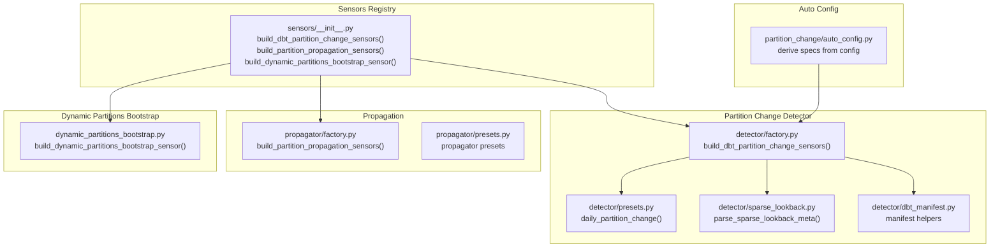
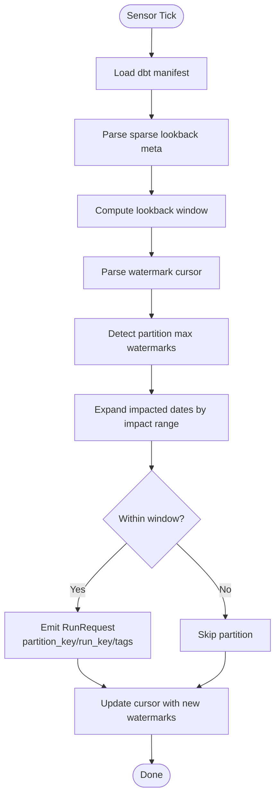
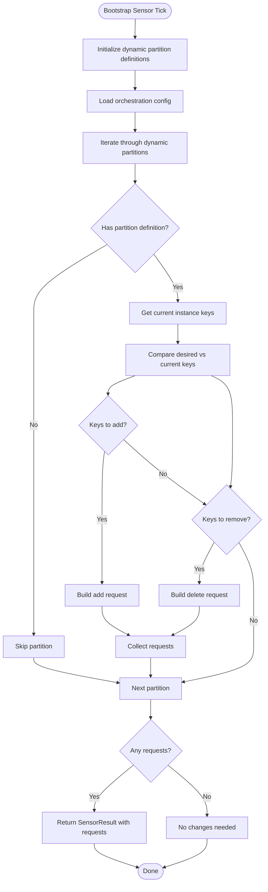
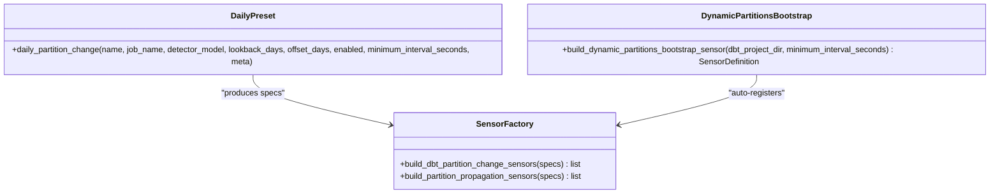
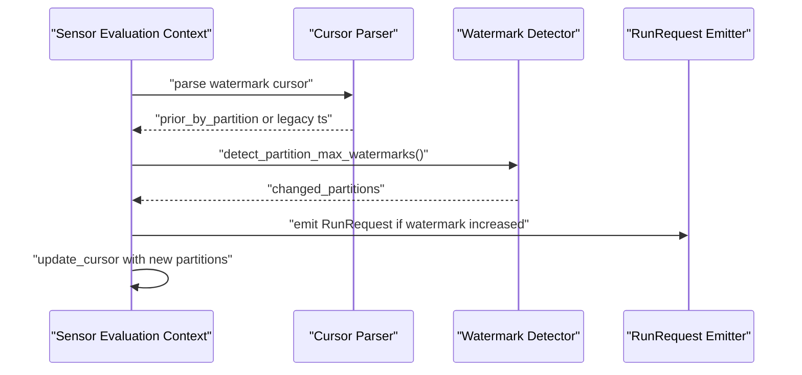
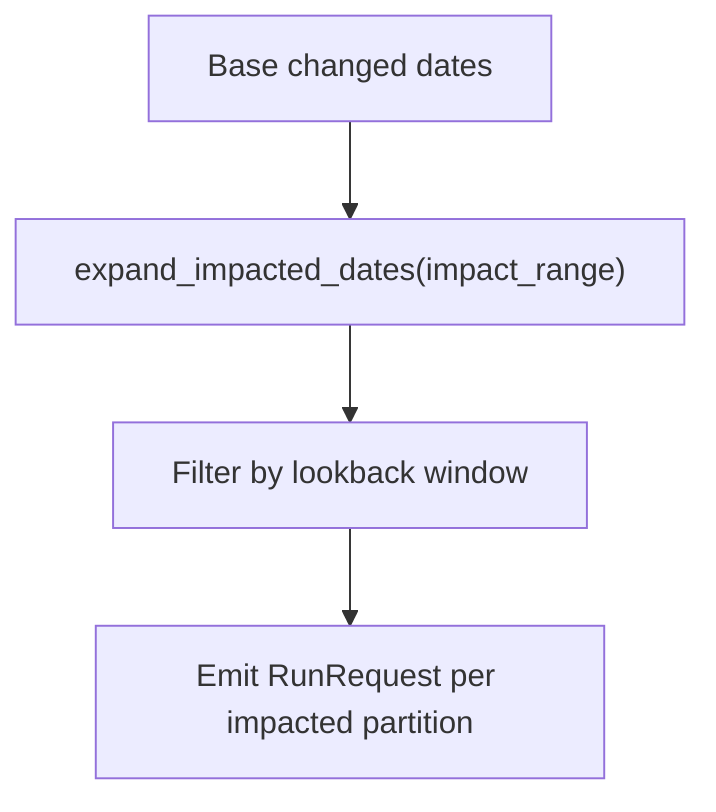
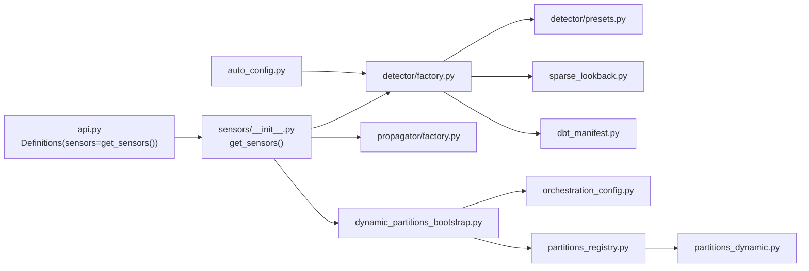

# Sensor Configuration

<cite>
**Referenced Files in This Document**
- [sensors/__init__.py](file://src/dbt_dagsterizer/sensors/__init__.py)
- [partition_change/auto_config.py](file://src/dbt_dagsterizer/sensors/partition_change/auto_config.py)
- [partition_change/detector/factory.py](file://src/dbt_dagsterizer/sensors/partition_change/detector/factory.py)
- [partition_change/detector/presets.py](file://src/dbt_dagsterizer/sensors/partition_change/detector/presets.py)
- [partition_change/detector/dbt_manifest.py](file://src/dbt_dagsterizer/sensors/partition_change/detector/dbt_manifest.py)
- [partition_change/detector/sparse_lookback.py](file://src/dbt_dagsterizer/sensors/partition_change/detector/sparse_lookback.py)
- [partition_change/propagator/factory.py](file://src/dbt_dagsterizer/sensors/partition_change/propagator/factory.py)
- [partition_change/propagator/presets.py](file://src/dbt_dagsterizer/sensors/partition_change/propagator/presets.py)
- [dynamic_partitions_bootstrap.py](file://src/dbt_dagsterizer/sensors/dynamic_partitions_bootstrap.py)
- [api.py](file://src/dbt_dagsterizer/api.py)
- [orchestration_config.py](file://src/dbt_dagsterizer/orchestration_config.py)
- [partitions_dynamic.py](file://src/dbt_dagsterizer/partitions_dynamic.py)
- [partitions_registry.py](file://src/dbt_dagsterizer/partitions_registry.py)
- [test_partition_change_sensor_impact_range.py](file://tests/test_partition_change_sensor_impact_range.py)
- [test_partition_change_sensor_watermark_dedupe.py](file://tests/test_partition_change_sensor_watermark_dedupe.py)
- [test_partition_change_sensor_missing_relation.py](file://tests/test_partition_change_sensor_missing_relation.py)
- [test_dynamic_partitions.py](file://tests/test_dynamic_partitions.py)
- [otel/dagster.py](file://src/dbt_dagsterizer/otel/dagster.py)
</cite>

## Update Summary
**Changes Made**
- Added comprehensive documentation for the new dynamic partitions bootstrap sensor
- Updated project structure to include dynamic partitions bootstrap sensor module
- Enhanced core components section with dynamic partition synchronization mechanism
- Added detailed explanation of bidirectional synchronization between configuration and Dagster instance
- Updated architecture overview to include dynamic partitions bootstrap workflow
- Added troubleshooting guide section for dynamic partition synchronization issues
- Integrated dynamic partitions bootstrap sensor into sensor registration and API integration

## Table of Contents
1. [Introduction](#introduction)
2. [Project Structure](#project-structure)
3. [Core Components](#core-components)
4. [Architecture Overview](#architecture-overview)
5. [Detailed Component Analysis](#detailed-component-analysis)
6. [Dependency Analysis](#dependency-analysis)
7. [Performance Considerations](#performance-considerations)
8. [Troubleshooting Guide](#troubleshooting-guide)
9. [Conclusion](#conclusion)
10. [Appendices](#appendices)

## Introduction
This document explains sensor configuration in dbt-dagsterizer with a focus on partition change detection, upstream/downstream tracking, watermark management, and dynamic partition synchronization. It covers sensor factory patterns, preset configurations, custom sensor creation, sparse lookback strategies, impact range calculation, propagation patterns, dynamic partition bootstrap functionality, naming conventions, tags, metadata, configuration options, performance tuning, monitoring, and integration with external data sources.

## Project Structure
The sensor subsystem resides under src/dbt_dagsterizer/sensors and is composed of:
- Partition change detection: detector module with factory, presets, sparse lookback, and dbt manifest helpers
- Propagation sensors: propagator module with factory and presets
- Dynamic partitions bootstrap sensor: automatic synchronization of dynamic partition keys with configuration
- Auto-configuration: automatic generation of sensors from project configuration
- Sensors registry: sensors/__init__.py aggregates sensors for inclusion in Definitions



**Diagram sources**
- [sensors/__init__.py:40-81](file://src/dbt_dagsterizer/sensors/__init__.py#L40-L81)
- [partition_change/detector/factory.py:48-65](file://src/dbt_dagsterizer/sensors/partition_change/detector/factory.py#L48-L65)
- [partition_change/detector/presets.py:1-35](file://src/dbt_dagsterizer/sensors/partition_change/detector/presets.py#L1-L35)
- [partition_change/detector/sparse_lookback.py](file://src/dbt_dagsterizer/sensors/partition_change/detector/sparse_lookback.py)
- [partition_change/detector/dbt_manifest.py](file://src/dbt_dagsterizer/sensors/partition_change/detector/dbt_manifest.py)
- [partition_change/propagator/factory.py](file://src/dbt_dagsterizer/sensors/partition_change/propagator/factory.py)
- [partition_change/propagator/presets.py](file://src/dbt_dagsterizer/sensors/partition_change/propagator/presets.py)
- [partition_change/auto_config.py:65-96](file://src/dbt_dagsterizer/sensors/partition_change/auto_config.py#L65-L96)
- [dynamic_partitions_bootstrap.py:36-123](file://src/dbt_dagsterizer/sensors/dynamic_partitions_bootstrap.py#L36-L123)

**Section sources**
- [sensors/__init__.py:40-81](file://src/dbt_dagsterizer/sensors/__init__.py#L40-L81)
- [partition_change/auto_config.py:65-96](file://src/dbt_dagsterizer/sensors/partition_change/auto_config.py#L65-L96)

## Core Components
- Sensor factory: builds sensor definitions from structured specs, validates inputs, and attaches metadata
- Preset builders: provide standardized sensor spec shapes (e.g., daily partition change)
- Sparse lookback parser: extracts detector metadata (partition date expression, updated-at expression, detect relation/source, impact scope)
- Watermark cursor: persists per-partition timestamps to deduplicate runs and avoid redundant work
- Propagation sensors: downstream sensors that react to upstream partition changes
- Dynamic partitions bootstrap sensor: automatically synchronizes dynamic partition keys with configuration file
- Auto-config: derives sensor specs from project configuration and environment
- Dynamic partition management: caching and synchronization of dynamic partition definitions

Key responsibilities:
- Detect partition changes via max-watermark queries against upstream sources
- Expand impact range to downstream assets
- Emit RunRequest with partition_key and run_key
- Tag runs with detector model, detect relation, and partition watermark
- Persist cursor for idempotency and future evaluation
- Synchronize dynamic partition keys between configuration and Dagster instance
- Maintain consistency across the Dagster instance

**Section sources**
- [partition_change/detector/factory.py:79-205](file://src/dbt_dagsterizer/sensors/partition_change/detector/factory.py#L79-L205)
- [partition_change/detector/presets.py:1-35](file://src/dbt_dagsterizer/sensors/partition_change/detector/presets.py#L1-L35)
- [partition_change/detector/sparse_lookback.py](file://src/dbt_dagsterizer/sensors/partition_change/detector/sparse_lookback.py)
- [partition_change/detector/dbt_manifest.py](file://src/dbt_dagsterizer/sensors/partition_change/detector/dbt_manifest.py)
- [partition_change/propagator/factory.py](file://src/dbt_dagsterizer/sensors/partition_change/propagator/factory.py)
- [partition_change/propagator/presets.py](file://src/dbt_dagsterizer/sensors/partition_change/propagator/presets.py)
- [partition_change/auto_config.py:65-96](file://src/dbt_dagsterizer/sensors/partition_change/auto_config.py#L65-L96)
- [dynamic_partitions_bootstrap.py:36-123](file://src/dbt_dagsterizer/sensors/dynamic_partitions_bootstrap.py#L36-L123)

## Architecture Overview
The sensor pipeline integrates dbt manifests, StarRocks resource access, and Dagster's sensor runtime. It detects upstream partition changes, expands impact ranges, and emits RunRequests for downstream assets. The dynamic partitions bootstrap sensor ensures consistency between configuration and the Dagster instance.

```mermaid
sequenceDiagram
participant DC as "Dagster Scheduler"
participant SF as "Sensor Factory<br/>detector/factory.py"
participant MF as "Manifest Loader<br/>dbt_manifest.py"
participant SL as "Sparse Lookback Parser<br/>sparse_lookback.py"
participant SRC as "StarRocks Resource"
participant WM as "Watermark Cursor"
participant PR as "RunRequest Emitter"
DC->>SF : "evaluate_tick()"
SF->>MF : "load_manifest()"
SF->>SL : "parse_sparse_lookback_meta(meta)"
SF->>SRC : "detect_partition_max_watermarks()"
SRC-->>SF : "changed partitions + watermarks"
SF->>SF : "expand_impacted_dates(impact_range)"
SF->>WM : "persist cursor {type, last_check, partitions}"
SF->>PR : "yield RunRequest(partition_key, run_key, tags)"
sequenceDiagram
participant DBS as "Dynamic Partitions Bootstrap Sensor"
participant CFG as "Orchestration Config<br/>orchestration_config.py"
participant REG as "Partitions Registry<br/>partitions_registry.py"
participant INST as "Dagster Instance"
DBS->>CFG : "load_or_create(resolve_orchestration_path())"
CFG-->>DBS : "index_orch(config)"
DBS->>REG : "get_dynamic_partitions_defs(dbt_project_dir)"
REG-->>DBS : "cached dynamic partition definitions"
DBS->>INST : "get_dynamic_partition_keys(partition_name)"
INST-->>DBS : "current partition keys"
DBS->>DBS : "compare desired vs current keys"
DBS->>INST : "add_dynamic_partitions/delete_dynamic_partitions"
DBS-->>DBS : "return SensorResult with dynamic_partitions_requests"
```

**Diagram sources**
- [partition_change/detector/factory.py:87-201](file://src/dbt_dagsterizer/sensors/partition_change/detector/factory.py#L87-L201)
- [partition_change/detector/dbt_manifest.py](file://src/dbt_dagsterizer/sensors/partition_change/detector/dbt_manifest.py)
- [partition_change/detector/sparse_lookback.py](file://src/dbt_dagsterizer/sensors/partition_change/detector/sparse_lookback.py)
- [dynamic_partitions_bootstrap.py:62-123](file://src/dbt_dagsterizer/sensors/dynamic_partitions_bootstrap.py#L62-L123)
- [orchestration_config.py:120-191](file://src/dbt_dagsterizer/orchestration_config.py#L120-L191)
- [partitions_registry.py:55-74](file://src/dbt_dagsterizer/partitions_registry.py#L55-L74)

## Detailed Component Analysis

### Partition Change Detection Pipeline
- Sensor decorator: defines sensor name, job binding, interval, and required resource keys
- Manifest preparation: ensures dbt manifest exists and loads it
- Window computation: anchor day minus offset, lookback window
- Legacy cursor support: handles old timestamp cursors and migrates to partition watermark format
- Watermark detection: queries upstream sources for max(updated_at) per partition date
- Impact expansion: applies configured impact range to downstream partitions
- RunRequest emission: constructs partition_key and run_key, sets tags for observability
- Cursor update: stores per-partition watermark timestamps



**Diagram sources**
- [partition_change/detector/factory.py:95-201](file://src/dbt_dagsterizer/sensors/partition_change/detector/factory.py#L95-L201)

**Section sources**
- [partition_change/detector/factory.py:79-205](file://src/dbt_dagsterizer/sensors/partition_change/detector/factory.py#L79-L205)

### Dynamic Partitions Bootstrap Sensor
The dynamic partitions bootstrap sensor ensures that dynamic partition keys in the Dagster instance always match the `initial_partition_keys` from the orchestration configuration. It runs periodically and performs two-way synchronization:

- **Add missing keys**: Adds any keys from configuration that are missing from the instance
- **Remove extra keys**: Removes any keys from the instance that are not in configuration
- **Single source of truth**: Makes the orchestration configuration the authoritative source for dynamic partition keys

Key features:
- Periodic evaluation with configurable minimum interval (default: 60 seconds)
- Automatic initialization of dynamic partition definitions from configuration
- Comprehensive logging for tracking synchronization actions
- Safe handling of edge cases (missing definitions, empty keys, etc.)



**Diagram sources**
- [dynamic_partitions_bootstrap.py:62-123](file://src/dbt_dagsterizer/sensors/dynamic_partitions_bootstrap.py#L62-L123)

**Section sources**
- [dynamic_partitions_bootstrap.py:36-123](file://src/dbt_dagsterizer/sensors/dynamic_partitions_bootstrap.py#L36-L123)

### Sensor Factory Patterns and Presets
- daily_partition_change preset enforces non-empty names/jobs/models and positive intervals
- build_dbt_partition_change_sensors validates uniqueness of sensor names and constructs sensor definitions
- Propagator sensors are built similarly and integrated via sensors/__init__.py
- Dynamic partitions bootstrap sensor is automatically registered during sensor construction



**Diagram sources**
- [partition_change/detector/presets.py:1-35](file://src/dbt_dagsterizer/sensors/partition_change/detector/presets.py#L1-L35)
- [partition_change/detector/factory.py:48-65](file://src/dbt_dagsterizer/sensors/partition_change/detector/factory.py#L48-L65)
- [partition_change/propagator/factory.py](file://src/dbt_dagsterizer/sensors/partition_change/propagator/factory.py)
- [dynamic_partitions_bootstrap.py:36-123](file://src/dbt_dagsterizer/sensors/dynamic_partitions_bootstrap.py#L36-L123)

**Section sources**
- [partition_change/detector/presets.py:1-35](file://src/dbt_dagsterizer/sensors/partition_change/detector/presets.py#L1-L35)
- [partition_change/detector/factory.py:48-65](file://src/dbt_dagsterizer/sensors/partition_change/detector/factory.py#L48-L65)
- [dynamic_partitions_bootstrap.py:36-123](file://src/dbt_dagsterizer/sensors/dynamic_partitions_bootstrap.py#L36-L123)

### Sparse Lookback Strategies and Metadata
- parse_sparse_lookback_meta reads detector meta to configure:
  - partition_date_expr: column used to derive partition date
  - updated_at_expr: column used to compute max watermark
  - detect_relation/detect_source: upstream relation to monitor
  - impact: downstream propagation scope
- These fields guide manifest parsing and impact range expansion

**Section sources**
- [partition_change/detector/sparse_lookback.py](file://src/dbt_dagsterizer/sensors/partition_change/detector/sparse_lookback.py)
- [partition_change/detector/factory.py:93-93](file://src/dbt_dagsterizer/sensors/partition_change/detector/factory.py#L93-L93)

### Watermark Management and Cursor Formats
- Legacy cursor: numeric timestamp fallback
- Current cursor: JSON payload with type, last_check, and partitions map
- Deduplication: if current watermark equals stored watermark for a partition, skip emitting RunRequest
- Tests demonstrate watermark updates and deduplication behavior



**Diagram sources**
- [partition_change/detector/factory.py:100-201](file://src/dbt_dagsterizer/sensors/partition_change/detector/factory.py#L100-L201)
- [test_partition_change_sensor_watermark_dedupe.py:81-117](file://tests/test_partition_change_sensor_watermark_dedupe.py#L81-L117)

**Section sources**
- [partition_change/detector/factory.py:100-201](file://src/dbt_dagsterizer/sensors/partition_change/detector/factory.py#L100-L201)
- [test_partition_change_sensor_watermark_dedupe.py:81-117](file://tests/test_partition_change_sensor_watermark_dedupe.py#L81-L117)

### Impact Range Calculation and Propagation Patterns
- expand_impacted_dates applies configured impact range to base changed dates
- Tests validate that only affected partitions are emitted within the lookback window
- Propagator sensors react to upstream partition changes and schedule downstream assets



**Diagram sources**
- [partition_change/detector/factory.py:166-178](file://src/dbt_dagsterizer/sensors/partition_change/detector/factory.py#L166-L178)
- [test_partition_change_sensor_impact_range.py](file://tests/test_partition_change_sensor_impact_range.py)

**Section sources**
- [partition_change/detector/factory.py:166-178](file://src/dbt_dagsterizer/sensors/partition_change/detector/factory.py#L166-L178)
- [test_partition_change_sensor_impact_range.py](file://tests/test_partition_change_sensor_impact_range.py)

### Sensor Naming Conventions, Tags, and Metadata
- Naming: defaults to "{model}_partition_change_sensor" when not explicitly set
- Tags: include detector model, detect relation, and partition watermark
- Metadata: passed through meta field to influence detection behavior
- Dynamic partitions bootstrap sensor: named "dynamic_partitions_bootstrap_sensor"

**Section sources**
- [partition_change/auto_config.py:71-71](file://src/dbt_dagsterizer/sensors/partition_change/auto_config.py#L71-L71)
- [partition_change/detector/factory.py:185-189](file://src/dbt_dagsterizer/sensors/partition_change/detector/factory.py#L185-L189)
- [dynamic_partitions_bootstrap.py:62-66](file://src/dbt_dagsterizer/sensors/dynamic_partitions_bootstrap.py#L62-L66)

### Sensor Configuration Options and Auto-Config
- lookback_days: number of days to scan for changes
- offset_days: delay from anchor day to shift the window
- minimum_interval_seconds: throttle between evaluations
- name/job_name/detector_model: identity and binding
- meta: detector configuration (partition_date_expr, updated_at_expr, detect_relation/detect_source, impact)

Auto-config derives specs from project configuration and environment variables.

**Section sources**
- [partition_change/detector/presets.py:1-35](file://src/dbt_dagsterizer/sensors/partition_change/detector/presets.py#L1-L35)
- [partition_change/auto_config.py:68-96](file://src/dbt_dagsterizer/sensors/partition_change/auto_config.py#L68-L96)

### Integration with External Data Sources and Observable Triggers
- Required resource: starrocks resource key enables watermark detection
- Unknown relations/sources cause skip messages with informative errors
- Observability: OpenTelemetry instrumentation records sensor transactions and tags

**Section sources**
- [partition_change/detector/factory.py:85-85](file://src/dbt_dagsterizer/sensors/partition_change/detector/factory.py#L85-L85)
- [test_partition_change_sensor_missing_relation.py:46-65](file://tests/test_partition_change_sensor_missing_relation.py#L46-L65)
- [otel/dagster.py:93-136](file://src/dbt_dagsterizer/otel/dagster.py#L93-L136)

### Custom Sensor Creation Examples
- Build sensor specs using daily_partition_change preset
- Construct sensors via build_dbt_partition_change_sensors
- Optionally integrate propagation sensors via build_partition_propagation_sensors
- Register sensors in Definitions alongside jobs
- Dynamic partitions bootstrap sensor is automatically included

**Section sources**
- [partition_change/detector/presets.py:1-35](file://src/dbt_dagsterizer/sensors/partition_change/detector/presets.py#L1-L35)
- [partition_change/detector/factory.py:48-65](file://src/dbt_dagsterizer/sensors/partition_change/detector/factory.py#L48-L65)
- [sensors/__init__.py:40-81](file://src/dbt_dagsterizer/sensors/__init__.py#L40-L81)

## Dependency Analysis
The sensors registry composes detector, propagator, and dynamic partitions bootstrap factories, which depend on presets, sparse lookback parsing, dbt manifest helpers, and orchestration configuration. Auto-config feeds specs into the detector factory, while the dynamic partitions bootstrap sensor depends on orchestration configuration and partitions registry.



**Diagram sources**
- [api.py:54-68](file://src/dbt_dagsterizer/api.py#L54-L68)
- [sensors/__init__.py:40-81](file://src/dbt_dagsterizer/sensors/__init__.py#L40-L81)
- [partition_change/detector/factory.py:48-65](file://src/dbt_dagsterizer/sensors/partition_change/detector/factory.py#L48-L65)
- [partition_change/propagator/factory.py](file://src/dbt_dagsterizer/sensors/partition_change/propagator/factory.py)
- [partition_change/detector/presets.py:1-35](file://src/dbt_dagsterizer/sensors/partition_change/detector/presets.py#L1-L35)
- [partition_change/detector/sparse_lookback.py](file://src/dbt_dagsterizer/sensors/partition_change/detector/sparse_lookback.py)
- [partition_change/detector/dbt_manifest.py](file://src/dbt_dagsterizer/sensors/partition_change/detector/dbt_manifest.py)
- [partition_change/auto_config.py:65-96](file://src/dbt_dagsterizer/sensors/partition_change/auto_config.py#L65-L96)
- [dynamic_partitions_bootstrap.py:17-23](file://src/dbt_dagsterizer/sensors/dynamic_partitions_bootstrap.py#L17-L23)
- [orchestration_config.py:17-23](file://src/dbt_dagsterizer/orchestration_config.py#L17-L23)
- [partitions_registry.py:14-20](file://src/dbt_dagsterizer/partitions_registry.py#L14-L20)
- [partitions_dynamic.py:10-12](file://src/dbt_dagsterizer/partitions_dynamic.py#L10-L12)

**Section sources**
- [api.py:54-68](file://src/dbt_dagsterizer/api.py#L54-L68)
- [sensors/__init__.py:40-81](file://src/dbt_dagsterizer/sensors/__init__.py#L40-L81)

## Performance Considerations
- minimum_interval_seconds: tune to balance sensitivity vs. overhead
- lookback_days and offset_days: adjust window size to reduce unnecessary scans
- Watermark deduplication: prevents redundant runs; ensure updated_at_expr reflects true upstream freshness
- Impact range: keep impact minimal to limit downstream fan-out
- Resource contention: ensure starrocks resource availability and connection pooling
- Dynamic partitions bootstrap: default 60-second interval is suitable for most use cases; adjust based on configuration complexity

## Troubleshooting Guide
Common issues and resolutions:
- Unknown database/relation errors: verify detect_relation/detect_source and manifest alignment
- No RunRequests emitted: check lookback window, watermark thresholds, and impact range
- Cursor anomalies: inspect legacy vs. partition watermark formats; ensure proper migration
- Sensor disabled or missing: confirm auto-config and environment variable LUBAN_PARTITION_CHANGE_PROPAGATOR_MODE
- Dynamic partition synchronization issues: check orchestration configuration file syntax and permissions
- Missing dynamic partition definitions: ensure partitions registry is properly initialized before sensor evaluation
- Key synchronization failures: verify that Dagster instance has write permissions for dynamic partitions

**Section sources**
- [test_partition_change_sensor_missing_relation.py:46-65](file://tests/test_partition_change_sensor_missing_relation.py#L46-L65)
- [test_partition_change_sensor_watermark_dedupe.py:81-117](file://tests/test_partition_change_sensor_watermark_dedupe.py#L81-L117)
- [dynamic_partitions_bootstrap.py:76-87](file://src/dbt_dagsterizer/sensors/dynamic_partitions_bootstrap.py#L76-L87)

## Conclusion
The sensor subsystem provides robust, configurable partition change detection with sparse lookback, watermark management, and propagation. The addition of the dynamic partitions bootstrap sensor ensures consistency between configuration and the Dagster instance, making the orchestration configuration the single source of truth for dynamic partition keys. By leveraging presets, auto-config, and observability hooks, teams can efficiently orchestrate incremental asset refreshes while maintaining performance and reliability.

## Appendices

### Appendix A: Sensor Registration and API Integration
- Sensors are aggregated in sensors/__init__.py and included in Definitions via api.py
- AutomationConditionSensorDefinition is registered by default
- Dynamic partitions bootstrap sensor is automatically included in sensor registration

**Section sources**
- [sensors/__init__.py:40-81](file://src/dbt_dagsterizer/sensors/__init__.py#L40-L81)
- [api.py:54-68](file://src/dbt_dagsterizer/api.py#L54-L68)

### Appendix B: Dynamic Partitions Configuration
The orchestration configuration supports dynamic partitions with the following structure:

```yaml
partitions:
  dynamic:
    - name: country_code
      initial_partition_keys:
        - US
        - GB
        - DE
    - name: tenant_id  
      initial_partition_keys:
        - tenant_1
        - tenant_2
```

The dynamic partitions bootstrap sensor uses this configuration to synchronize partition keys between the orchestration configuration and the Dagster instance.

**Section sources**
- [orchestration_config.py:112-191](file://src/dbt_dagsterizer/orchestration_config.py#L112-L191)
- [dynamic_partitions_bootstrap.py:85-87](file://src/dbt_dagsterizer/sensors/dynamic_partitions_bootstrap.py#L85-L87)

### Appendix C: Dynamic Partitions Bootstrap Sensor Implementation Details
The dynamic partitions bootstrap sensor provides bidirectional synchronization between the orchestration configuration and the Dagster instance:

1. **Initialization Phase**: The sensor initializes dynamic partition definitions from the orchestration configuration before running
2. **Comparison Logic**: For each dynamic partition, it compares desired keys from configuration with current keys in the instance
3. **Action Execution**: 
   - Adds keys present in configuration but missing from the instance
   - Removes keys present in the instance but not in configuration
4. **Logging and Monitoring**: Comprehensive logging tracks all synchronization actions and results

**Section sources**
- [dynamic_partitions_bootstrap.py:36-123](file://src/dbt_dagsterizer/sensors/dynamic_partitions_bootstrap.py#L36-L123)
- [partitions_registry.py:55-74](file://src/dbt_dagsterizer/partitions_registry.py#L55-L74)
- [partitions_dynamic.py:18-52](file://src/dbt_dagsterizer/partitions_dynamic.py#L18-L52)